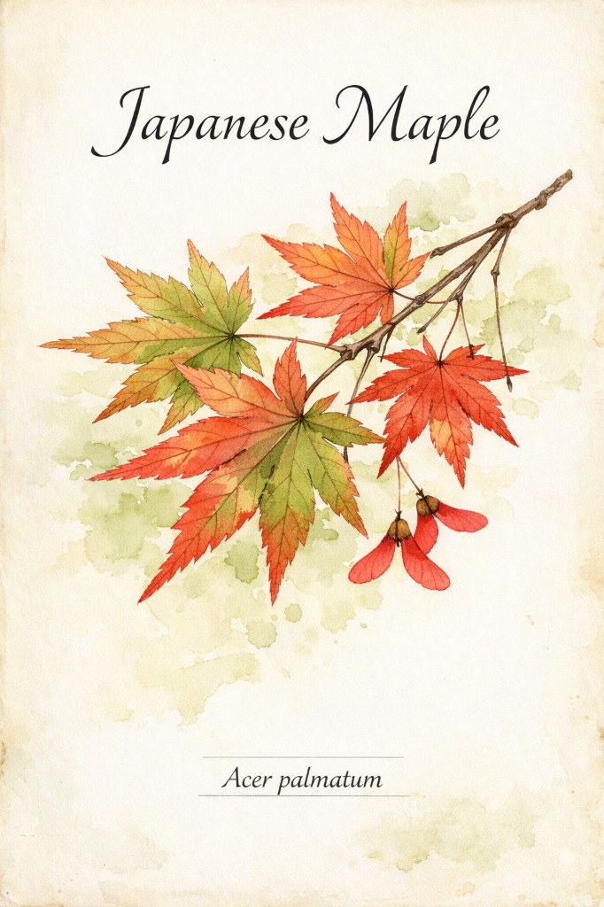
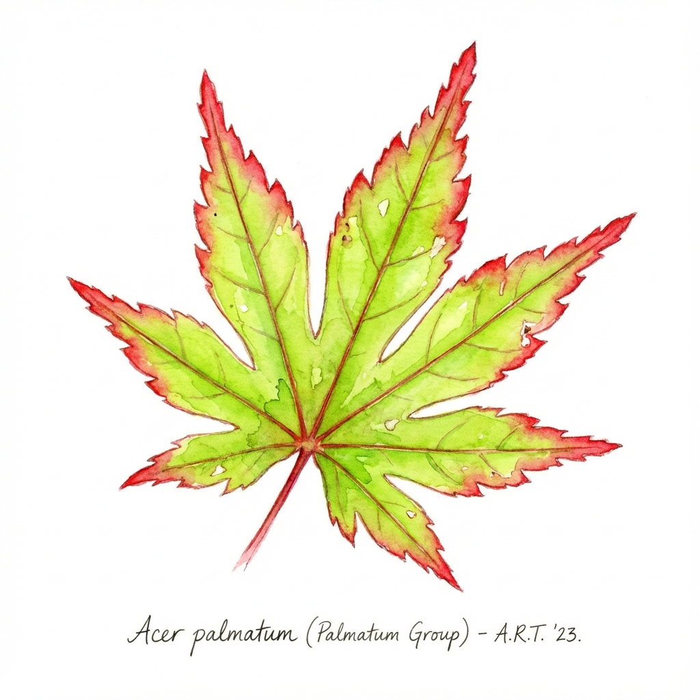
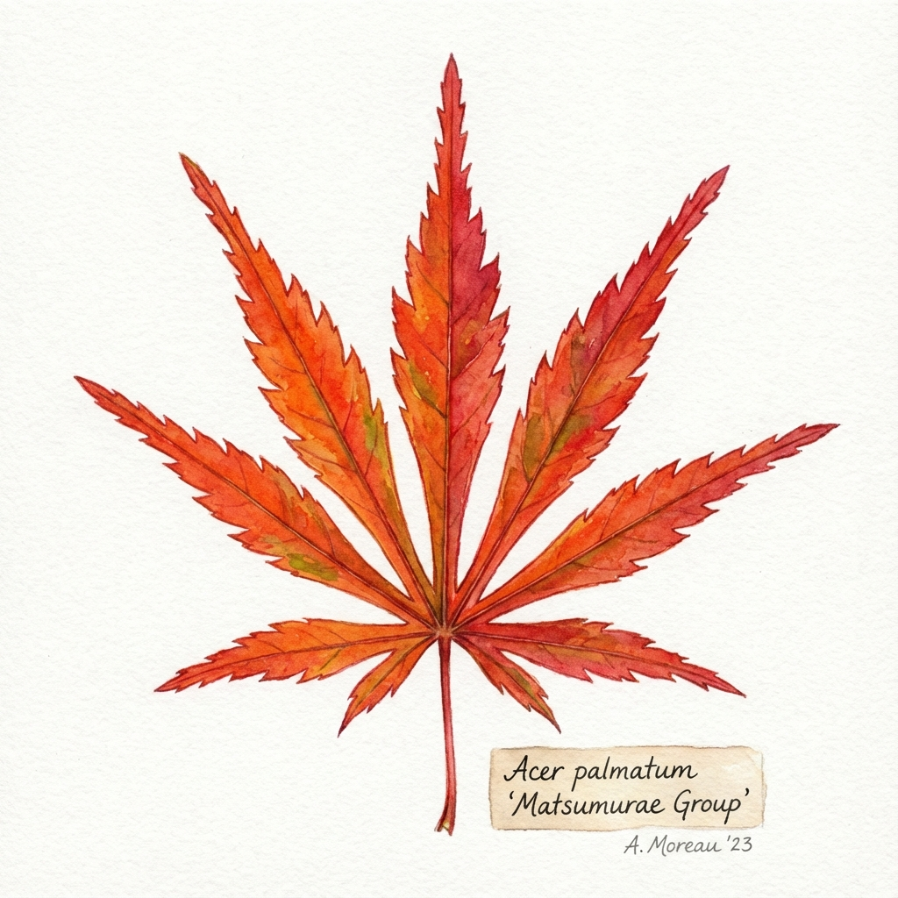
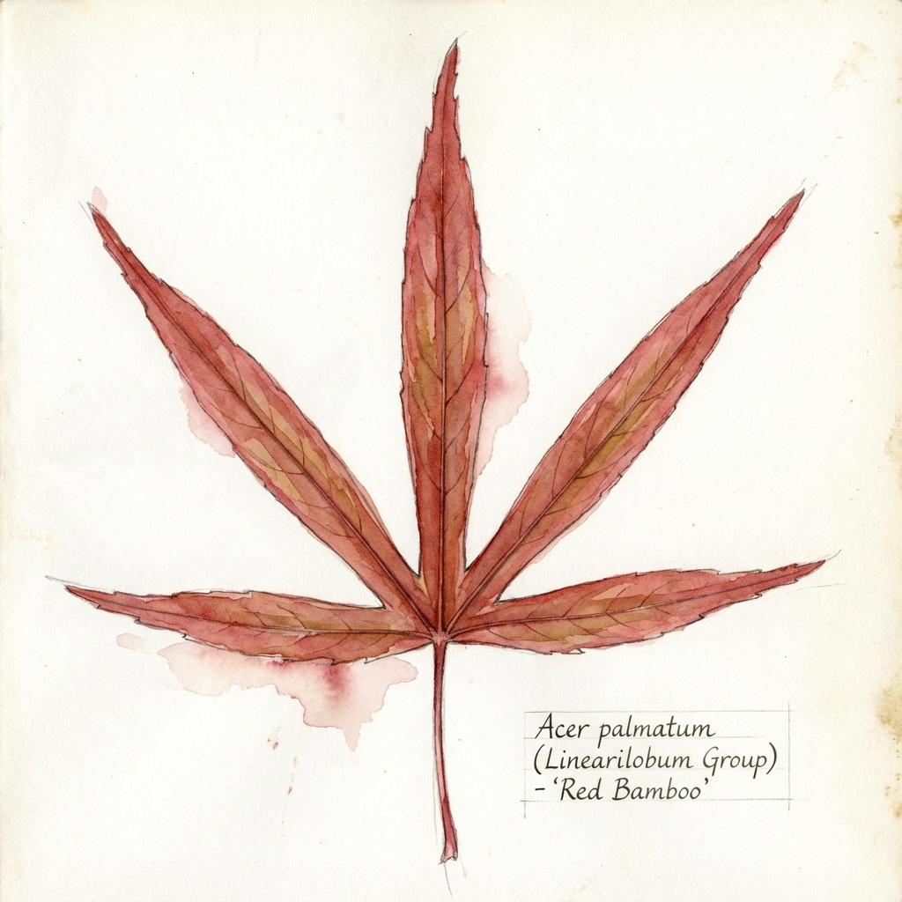
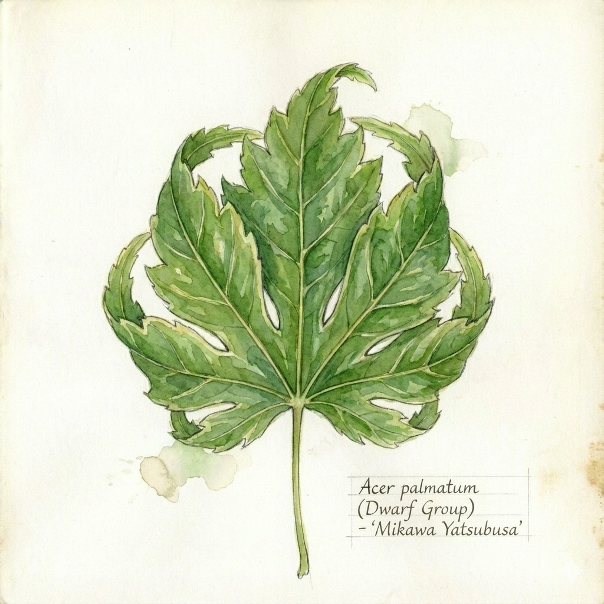
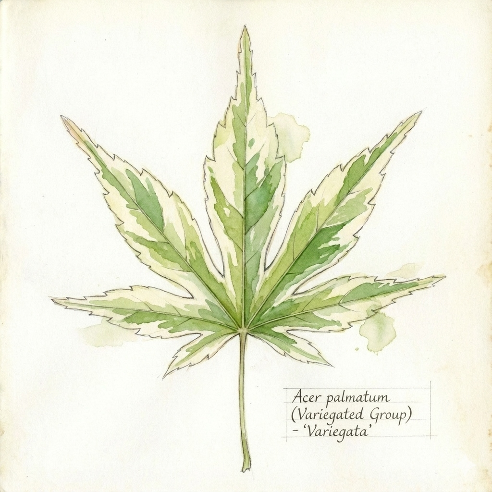

% The Japanese Maple Book
% Revised Digital Edition by rightedges with Gemini AI
% © 2025 rightedges with Gemini AI

---

# The Japanese Maple Book

Welcome to the digital edition of *The Japanese Maple Book*. This guide explores the history, varieties, and care of *Acer palmatum*.

Please use the navigation sidebar to browse the chapters.

[Download EPUB Version (v1.1 - Dec 2025)](book.epub)

---

# Introduction to *Acer palmatum*

## The Quintessential Garden Aristocrat

Few trees command the reverence of the Japanese Maple (*Acer palmatum*). In ornamental horticulture, it is a unique synthesis of architectural grace, seasonal dynamism, and botanical diversity. To plant a Japanese maple is to appreciate the subtle shifts of nature. This chapter introduces the species: its origins, biological needs, and cultural journey from Japan to the world.

## Botanical Identity

The Japanese maple belongs to the genus *Acer* (*maples*) and the section *Palmata*. The name *palmatum* comes from the Latin *palma* (palm of the hand), referring to leaves with 5, 7, or 9 lobes radiating like fingers.

While often grouped together, it is distinct from its relatives:
*   ***Acer japonicum*** (**Fullmoon Maple**): Larger leaves with more lobes (9-13) and a rounder appearance.
*   ***Acer shirasawanum***: Prized for hardiness and fan-like foliage (e.g., 'Autumn Moon).
*   ***Acer sieboldianum***: A hardy mountain species similar to *palmatum*.

The defining trait of *Acer palmatum* is its **genetic instability**. This natural propensity for mutation allows the species to produce endless variations in color, shape, and habit, which is why thousands of unique cultivars exist today.

## Geographic Origins and Natural Habitat

*Acer palmatum* is native to Japan, Korea, and eastern China. In the wild, it is an **understory tree**, evolving beneath a canopy of larger hardwoods and pines. This history dictates its cultural requirements:

1.  **Light**: Adapted to dappled sunlight. Filtered light is ideal; harsh afternoon sun can scorch the leaves.
2.  **Wind**: Shelter is essential. Thin leaves and graceful branches are susceptible to drying winds (tattering).
3.  **Soil**: Craves the forest floor: rich in organic matter, consistently moist but well-drained, and slightly acidic.

## Morphology: The Beauty of Form

### The Leaf
The leaf is the tree's primary identifier.
*   **Spring**: Emerging in vibrant pinks, oranges, or purples to protect tender tissue from UV rays.
*   **Summer**: Settling into mature shades of green, burgundy, or bronze.
*   **Autumn**: The grand finale. As chlorophyll fades, masked red (anthocyanin) and orange (carotenoid) pigments create the species' iconic fiery display.

### The Structure and Bark
*Acer palmatum* naturally creates a sympodial branching pattern—dividing frequently to form a sinuous, layered "cloud" of branches. Some cultivars also feature ornamental bark, such as the coral-red of 'Sango kaku' or the rough, corky texture of 'Arakawa'.

### Samaras (Whirlybirds)
The iconic winged seeds, or **samaras**, are designed to spin. This allows the wind to carry them away from the parent tree's shade toward potential pockets of light.

## A Cultural History

In Japan, the maple is celebrated as *momiji* (crimson leaves). 
*   **Heian Period (794-1185)**: *Momijigari* (maple hunting) became a courtly pastime, where nobles explored mountains to view autumn color, viewing the transient red leaves as a reflection of *mono no aware*—the sensitive pathos of ephemera.
*   **Edo Period (1603-186)**: Modern cultivation exploded during this era of peace. Samurai and nurserymen began isolating wild mutations, cataloging dozens of varieties in works like the *Kaedebyō*.

The West discovered these treasures in the 19th century through botanists like von Siebold. By the 20th century, Japanese Maples had become staples of European and American landscapes.

## Summary

The Japanese Maple is more than a decoration; it is a living organism with an evolutionary memory of the forest understory. Success comes from respecting that memory—providing the cool, sheltered environment its ancestors enjoyed. In the following chapters, we will learn how to choose, plant, and care for these spectacular trees.

---

# The 8 Groups of Japanese Maples: A Framework for Beauty

For the novice gardener, the sheer variety of *Acer palmatum* can be paralyzing. With over 1,000 named cultivars—ranging from 30-foot shade trees to 12-inch bonsai subjects, and from "bamboo-leafed" red spears to "lace-leafed" emerald mounds—the species seems to defy categorization. However, botanists and dedicated enthusiasts have historically organized these into eight distinct groups. 

This classification system is not merely academic; it is the most powerful tool you have for garden design. By knowing which group a tree belongs to, you can instantly predict its growth rate, its ultimate size, its sunlight requirements, and its textural impact on your landscape. In this chapter, we go deep into the botanical markers, historical context, and horticultural nuances of each group.

---

## 1. Palmatum Group (The Genetic Standard)

The **Palmatum** group is the baseline for the species. These trees are the closest in morphology to the wild maples found on the mountainsides of Japan. They are the "workhorses" of the landscape—vigorous, resilient, and structurally sound.

### Botanical Markers
*   **Leaf Shape**: The classic "palm" shape. Typically features five to seven lobes.
*   **Sinuses**: The divisions between the lobes (sinuses) are moderate, usually reaching about halfway to two-thirds of the way toward the leaf base.
*   **Serration**: Fine to medium-toothed edges.
*   **Habit**: Strongly upright and often multi-stemmed. They are fast-growers in their youth, reaching 15-25 feet at maturity.

### Cultivation and Aesthetic Role
Trees in this group, like the legendary **'Bloodgood'** or the spring-wonder **'Katsura'**, are the most sun-tolerant of all Japanese Maples. Their leaves are physically tougher, with a thicker cuticle (waxy outer layer) that resists desiccation. 
**Landscape tip**: Use Palmatum group trees as "anchor" specimens or as a canopy layer for shade-loving perennials. If you are a first-time owner, this group offers the highest "margin for error."

---

## 2. Amoenum Group (The Broad-Leafed Elegance)

The word "Amoenum" translates roughly to "pleasing" or "delightful." This group represents the transition from the wild look of the Palmatum group to a more refined, architectural leaf.

### Botanical Markers
*   **Leaf Shape**: Larger, broader, and more "complete" looking than the Palmatum group.
*   **Lobes**: Almost always seven to nine lobes.
*   **Sinuses**: The sinuses are decidedly shallow, often reaching less than halfway to the leaf base. This creates a leaf that looks more like a solid hand with fingers rather than separate leaflets.
*   **Habit**: These trees tend to form broad, umbrella-shaped or round-headed canopies. They are often slower and more majestic than the Palmatum group.

### The "Autumn King"
The most famous member of this group is **'Osakazuki'**. While its summer leaves are a handsome, simple green, its botanical structure allows it to hold an incredible amount of sugar as winter approaches, leading to the most intense scarlet-red fall color in the entire genus *Acer*.
**Landscape tip**: Because their leaves are larger, Amoenum types provide a much "denser" shade. They are perfect as standalone focal points where you want a "clean" and uniform silhouette.

---

## 3. Matsumurae Group (The Textural Deep-Cut)

Named after Jimbō Matsumura, a Japanese botanist, this group features leaves that look like they have been meticulously cut with scissors. They bridge the gap between "standard" leaves and the "lace-leaf" dissectums.

### Botanical Markers
*   **Leaf Shape**: Seven to nine lobes.
*   **Lobes**: Extremely deep sinuses that cut 90% of the way to the petiole (stem). The lobes are often narrow at the base and widen toward the tip.
*   **Edges**: Coarsely and irregularly serrated, giving the leaf an "edgy," almost jagged appearance.
*   **Habit**: Often naturally pendulous. Unlike the upright Palmatum group, Matsumurae branches like to arch and weep.

### Famous Specialists
The **'Sango Kaku'** (Coral Bark) is often placed here due to its leaf structure, though its main fame is its bark. The **'Omure yama'** is the quintessential Matsumurae, forming a literal "willow-like" waterfall of deeply-cut green leaves.
**Landscape tip**: These trees are "light filters." Because the leaves are so deeply divided, they allow dappled sunlight to penetrate through to the ground, making them perfect for "layering" with shade-tolerant shrubs like Azaleas beneath them.

---

## 4. Dissectum Group (The Queen of the Garden)

Often called "Lace-leaf" maples, these are the most highly prized for their fine-textured foliage and cascading forms.

### The Science of Dissection
In a dissectum leaf, the botanical "program" has gone into overdrive. Not only are the lobes divided all the way to the base (like a Matsumurae), but each lobe is itself "sub-divided" into smaller, thread-like leaflets.

*   **Habit**: Almost exclusively weeping or prostrate. If you don't stake them up, they will crawl along the ground.
*   **Growth Rate**: Slow to very slow. A 50-year-old Dissectum may only be 8 feet tall.
*   **The "Mound"**: They naturally form broad, dome-shaped mounds that look like living sculptures.

### The Vulnerability Factor
Because their leaves are so thin, they have almost no water-holding capacity. They are the "canary in the coal mine" for heat stress. In high heat or wind, the tips of a Dissectum will scorch (turn brown) within hours.
**Landscape tip**: Never plant a Dissectum in the middle of a wind-swept lawn in full sun unless you live in a very cool, humid climate. They are best tucked into north-facing corners or shaded by taller trees.

---

## 5. Linearilobum Group (The "Bamboo" Maples)

To the casual observer, these often don't even look like maples. They look more like bundles of bamboo or spider legs.

### Botanical Markers
*   **Leaf Shape**: Lobes are extremely long and narrow ("linear). In some cultivars like **'Koto no ito'** (Harp Strings), the lobes are no wider than a blade of grass.
*   **Habit**: Usually upright and vase-shaped, though they are often airy and transparent.

### Aesthetic Contrast
In garden design, we talk about "fine texture." Linearilobums are the ultimate fine-texture plant. They vibrate in even the slightest breeze.
**Landscape tip**: These are espectacular when planted in front of a solid, dark evergreen hedge or a stone wall. The "transparency" of the tree creates a sense of depth and mystery in the garden.

---

## 6. Dwarf Group (The Small-Space Heroes)

This is a functional group rather than a strictly botanical one. It includes maples that are genetically programmed for extremely slow growth and short internodes (the distance between leaves).

### The "Yatsubusa" Trait
In Japanese horticulture, the word *Yatsubusa* refers to "compact" or "congested." The most famous dwarf, **'Mikawa yatsubusa'**, features leaves that grow so close together they overlap like shingles on a roof. 

*   **Habit**: Dense, squat, and often weirdly architectural. They may only grow 1-2 inches per year.
*   **Bonsai favor**: Because their leaves and branches are naturally small, they are the first choice for bonsai artists.

---

## 7. Variegated Group (The Spotted Divas)

This group is defined by **mutation**. Specifically, a lack of chlorophyll in certain parts of the leaf, leading to white, pink, or yellow patterns.

### The "Reversion" Risk
Because the white parts of the leaf don't produce food, the tree is under constant stress. Often, a variegated tree will produce a "reversion"—a branch that is 100% green. Because the green branch is "stronger" (it has more fuel), it will quickly take over the tree and kill the variegated parts. You **must** prune out any solid green branches the moment they appear.

### Famous Cultivars
*   **'Ukigumo'** (Floating Cloud): Can be almost entirely white.
*   **'Butterfly'**: The classic cream-edged maple.
*   **'Higasayama'**: Emerges with pink tips that fade to white and green.

---

## 8. Shirasawanum Group (The Golden Full Moons)

While technically a different species, *Acer shirasawanum* (the Full Moon Maple) and its hybrids are now so integrated into the Japanese Maple world that they are formally treated as an eighth group. These are the "jewels" of the shaded garden.

### Botanical Markers
*   **Leaf Shape**: Rounder and more "fan-like" than *palmatum*.
*   **Lobes**: Typically 9 to 13 shallow lobes, giving the leaf a nearly circular silhouette.
*   **Color**: Famous for neon yellows and soft oranges.
*   **Habit**: Slower growing and typically smaller (8-15 feet), with a stiff, tiered branching habit.

### The "Aureum" Standard
The most famous member is **'Aureum'** (Golden Full Moon Maple). Its translucent, chartreuse-to-yellow leaves offer zero protection from UV rays, meaning they require almost constant shade. In the right spot, they glow as if illuminated from within.

## Summary Table: Group Selection Matrix

| Group | Best For | Sun Tolerance | Key Cultivar |
| :--- | :--- | :--- | :--- |
| **Palmatum** | Anchors / Shade | High | 'Bloodgood' |
| **Amoenum** | Clean Silhouettes | Medium | 'Osakazuki' |
| **Matsumurae** | Dappled Light | Medium | 'Sango Kaku' |
| **Dissectum** | Focal Points / Mounds | Low | 'Crimson Queen' |
| **Linearilobum** | Texture / Airy | Low-Med | 'Beni otake' |
| **Dwarf** | Rocks / Containers | High (usually) | 'Mikawa Yatsubusa' |
| **Variegated** | Collector "WOW" factor | Very Low | 'Ukigumo' |
| **Shirasawanum** | Shady "Glow" | Very Low | 'Aureum' |

---

# Buying Your First Tree: A Connoisseur's Guide

Embarking on the journey of Japanese Maple stewardship begins with a single, crucial moment: the purchase. While impulse buying so often plagues gardeners ("I have a spot for this somewhere!), selecting a Japanese Maple requires a discerning eye. You are not just buying a plant; you are buying a structure, a root system, and a genetic history.

Because these trees are long-lived (often exceeding a hundred years) and slow-growing, mistakes made at the nursery can take a decade to haunt you. A poorly placed graft or a girdled root is a "time bomb." In this expanded chapter, we go beyond the surface aesthetics of leaf color and dive into the technical and logistical realities of sourcing high-quality maples.

---

## 1. Where to Shop: The Specialist vs. The Chain

The first decision—where to source your tree—is the most significant factor in your long-term success.

### The Big Box Store (The Gamble)
Local garden centers and hardware chains will often carry a generic selection: usually 'Bloodgood', 'Crimson Queen', and standard green seedlings.
*   **The Problem of "Identity Theft"**: Many big-box maples are mass-produced in "tree factories." They are often mislabeled; a "Bloodgood" at a discount store is frequently just a random red seedling. These seedlings may look red in May, but by July, they will "wash out" to a muddy green-bronze, lacking the genetic stability of the true cultivar.
*   **Logistics of Neglect**: Trees in big-box stores are often treated like hardware. They are frequently left in standing water (leading to root rot) or pushed out into a hot asphalt parking lot (causing sunscald before you even get them home).

### The Specialist Nursery (The Gold Standard)
For the true enthusiast, online specialist nurseries or dedicated local collectors are the only option.
*   **Variety and Veracity**: A specialist will carry 200-500 different cultivars. More importantly, they guarantee the variety. They take their own scion wood from "mother trees" of known provenance.
*   **Care and Knowledge**: Specialists understand the specific needs of different groups. They won't place a variegated 'Ukigumo' in a 100°F sun-exposed lot.
*   **Shipping Realities**: When ordering online, you will likely receive a "1-gallon" or "3-gallon" tree. While it looks small, these young trees often establish faster and with less "transplant shock" than massive, expensive "Balled and Burlapped" (B&B) specimens.

---

## 2. Technical Inspection: The Anatomy of a Healthy Tree

When you are standing in front of a tree, do not look at the leaves first. Look at the plumbing.

### The Root Flare (Nebari)
The most common killer of trees is planting too deep. Look at the base of the trunk. It should flare out slightly where it enters the soil. If the trunk looks like a telephone pole going straight into the ground, it is buried too deep in the pot.
*   **The Investigation**: Don't be afraid to gently brush away the top half-inch of soil. You are looking for **Girdling Roots**. These are roots that have hit the side of the plastic pot and started to circle. As the trunk thickens, these circling roots will literally "strangle" the tree, cutting off the flow of sap. If you see roots tightly circling the trunk, put the tree back.

### The Graft Union: The Surgical Site
Ninety percent of named Japanese Maples are clones created through grafting.
1.  **Placement**: The graft should be low (ideally within 3-6 inches of the soil). High grafts (2 feet up) look like a "knee" in the trunk and are aesthetically displeasing as the tree ages.
2.  **Health**: Look for a clean union. The two woods should be fusing smoothly. If there is oozing, cracking, or if the scion (the top) is significantly thinner than the rootstock, it indicates a "mismatch" or "delayed incompatibility" that may lead to the top dying off in 5-10 years.
3.  **The "Dog-Leg"**: Avoid trees where the graft creates a sharp 45-degree kink. A high-quality grafter aligns the cambium layers so that the tree grows straight.

### The Stem and Leader
For upright varieties ('Bloodgood', 'Sango Kaku), look for a clear **central leader**. Avoid trees that have been "topped" in the nursery. If the main trunk has been cut, the tree will produce a chaotic cluster of weak "water sprouts" that will ruin the architectural structure of the mature tree.

---

## 3. The Science of the Graft: Scion and Rootstock

To understand your tree, you must understand its dual nature. A grafted maple is two different organisms living as one.

### Why We Graft
Japanese Maples are genetically "unstable." If you plant a seed from a 'Bloodgood', the baby will be a generic *Acer palmatum*. It will not have the intense color or the heat tolerance of the parent. To get an exact "clone," we must take a cutting. However, many delicate cultivars have "weak" roots that rot easily or grow too slowly.
**The Solution**: We take a vigorous seedling (the rootstock) and surgically attach the fancy cultivar (the scion) to it.

### Types of Grafts
*   **Side-Veneer Graft**: The most common. A sliver of bark is removed from the side of the rootstock, and the scion is tucked in. This creates the "best" long-term structural union.
*   **Cleft Graft**: The rootstock is split in the middle, and the scion is pushed in. This is often used for "Top-Grafted" weeping maples, but it creates a permanent "knob" that can be a structural weakness.

---

## 4. Shipping Logistics: Bare-Root vs. Potted

If you buy your first tree online, it will likely arrive in one of two ways.

### Potted (Year-Round)
The tree is shipped in its plastic nursery container.
*   **Pros**: Least amount of shock. You can wait a week or two before planting.
*   **Cons**: Shipping costs are high due to the weight of the soil. There is a higher chance of root-circling if the tree has been in that pot too long.

### Bare-Root (Winter/Early Spring Only)
The tree is dug up while dormant, and all soil is washed from the roots. It is shipped in moist sawdust or gel.
*   **Pros**: Incredible price savings on shipping. You get a perfect view of the entire root system, allowing you to prune away any defects before planting.
*   **Cons**: Must be planted **immediately** upon arrival. If the roots dry out for even an hour, the tree will die. It is a "surgical" operation that requires confidence.

---

## 5. The "Big Tree" Trap: Age vs. Survival

Every gardener wants the "instant landscape" provided by a 10-foot, $1,000 maple. However, this is often a mistake.

### Transplant Shock
A 10-foot tree has a massive root system. When it is dug up to be moved, 80-90% of its fine feeder roots are left behind in the field. The tree then spends the next 3 to 5 years in a state of "stasis" or "shock," trying to rebuild its roots before it can put on any new top growth.
In contrast, a small **3-gallon tree** has its entire root system intact. It will take off immediately. Within five years, the small tree will often be larger, healthier, and better shaped than the massive tree that has been struggling to survive transplant shock.

### The "Cost-per-Season" Rule
When buying, don't buy height; buy **trunk caliper** (thickness). A thick trunk indicates a healthy, well-fed root system. A tall, spindly tree has been "forced" with nitrogen and will be weak and brittle in your garden.

---

## 6. The Ultimate Buying Checklist

When you find "The One," do not leave the nursery until you have checked these six boxes:

1.  **Pest Check**: Look under the leaves for Aphids or Scale insects (see Chapter 1).
2.  **Bark Integrity**: Ensure there is no damage from weed-whackers or mower-stings at the base.
3.  **Drainage Test**: Look at the top of the soil. If it is covered in green moss or liverwort, the soil has been saturated for too long, indicating potential root rot.
4.  **Variety Verification**: Does the leaf look like it should for this variety? If it's a 'Sango Kaku', are the twigs actually red?
5.  **Wind-Burn Check**: If the tree has "crunchy" leaf tips right now, it's not a dealbreaker, but it tells you the tree has been stressed. You should negotiate a discount or look for a fresher specimen.
6.  **The "Wobble" Test**: Gently grab the trunk and wiggle it. If the whole tree pivots in the pot like a loose tooth, it hasn't established roots in that container yet. It is essentially a "freshly potted" tree and is more vulnerable.

---

## Summary: A Multi-Generational Purchase

Buying a Japanese Maple is not like buying a flat of petunias. You are bringing home a living heirloom. If you choose a tree with a solid root flare, a clean graft, and a strong central leader, you are setting the stage for a century of beauty. 

Take your time. Visit multiple nurseries. Ask the grower how they propagation their trees. A good grower loves to talk about their "babies." If the salesperson doesn't know the difference between a Palmatum and a Matsumurae, walk away. Your garden deserves the best genetics and the cleanest structure you can find. Remember: the cheap tree you buy today will cost you ten times as much in disappointment five years from now.

---

# Siting and Planting: Finding the Perfect Home

The most important decision you will make for your Japanese Maple happens before you even start digging. "Right Tree, Right Place" is the golden rule. A maple planted in the right spot will thrive for decades with very little help from you. A tree in the wrong spot will struggle no matter how much you care for it.

This chapter helps you find that perfect spot and shows you how to plant your tree correctly from day one.

---

## 1. Sunlight: The Morning Friend and Afternoon Foe

While maples need sun to grow and show off their colors, too much hot sun can burn their delicate leaves.
*   **Morning Sun is Good**: Try to find a spot that gets direct sun in the morning. This is cool light that helps the tree grow without getting too hot.
*   **Afternoon Shade is Better**: The afternoon sun (from 1:00 PM to 4:00 PM) is the harshest. If possible, pick a spot where the tree is in the shadow of the house or a fence during those hot hours.
*   **The Green and Red Rule**: Generally, green-leafed maples need more shade than red-leafed ones. If your red maple turns green in summer, it might need a bit more sun!

---

## 2. Wind: Protect Those Delicate Leaves

Japanese Maples have very thin leaves that can dry out quickly in the wind.
*   **The Problem**: Strong wind strips the moisture away from the leaves faster than the roots can replace it. This leads to brown, "shredded" leaf edges.
*   **The Solution**: Don't plant your maple in a wide-open, windy corner. Instead, look for a spot near a fence, a wall, or other larger trees that can act as a windbreak.

---

## 3. Drainage: No "Wet Feet"

More Japanese Maples are killed by too much water than by too little. They hate having their roots sitting in a puddle of water.
*   **The Test**: Dig a small hole and fill it with water. If the water is still there an hour later, your soil drains too slowly.
*   **The Mound Fix**: If your ground is heavy clay and holds water, don't dig a deep hole. Instead, place the tree on top of the ground and build a "mound" of soil up around it. This ensures the main roots are always above the waterline.

---

## 4. How to Plant: The "Donut" Technique

When you are ready to plant, follow these simple steps:
1.  **Don't Dig Too Deep**: The hole should be wide, but keep it shallow. You want the "flare" (where the trunk becomes roots) to be visible above the ground.
2.  **Use Native Soil**: Don't fill the hole with fancy potting soil. Using the same dirt that's already in your garden forces the roots to grow out and get strong.
3.  **Water Deeply**: Once the tree is in the ground, give it a long, slow soak to settle the soil.

---

## Summary: Think Like a Tree

Before you plant, spend a day watching the sun and wind in your garden. Look for a spot that feels cool, protected, and has good drainage. If you build a solid foundation today, your Japanese Maple will reward you with a lifetime of effortless, spectacular beauty.

---

# Watering and Mulching: Keep the Roots Happy

If light is the engine of a Japanese Maple, water is the fuel. Because maples have thin leaves and shallow roots, they don't have much of a "reserve" for dry days. While a big Oak tree can go weeks without rain, a Japanese Maple can be hurt by just one really hot, dry afternoon.

However, "Watering" doesn't mean just spraying the tree with a hose every day. This chapter explains the simple science of watering and how to use mulch to keep your tree healthy.

---

## 1. The Simple Test: Use Your Finger

The biggest mistake people make is watering on a schedule (like "every Monday). Instead, you should water whenever the tree *needs* it.
*   **The Finger Test**: Stick your finger two inches into the dirt. 
    *   If it feels damp and cool like a wrung-out sponge, the tree is fine. 
    *   If it feels dry and dusty, give it a long, slow soak.
    *   If it feels like mud, you are watering too much. Stop and let it dry out!

---

## 2. Rainwater is Best

If you can, use a rain barrel to collect water for your maples. 
*   **The Reason**: Maples love acidic soil. Tap water in many cities is a bit too alkaline (chalky) for them. Over time, tap water can make it harder for the tree to "eat" the nutrients in the soil.
*   **Rain is Magic**: Rainwater is naturally slightly acidic, which is exactly what a Japanese Maple wants. 

---

## 3. How to Water: "Slow and Deep"

When you do water, don't just spray the leaves.
*   **The Ground is the Goal**: Focus the water on the ground around the tree. 
*   **Slow Down**: Use a slow trickle from a hose or a drip system. You want the water to sink deep into the ground rather than just running off the surface. Deep water encourages the roots to grow deep, which helps the tree survive hot summers.

---

## 4. Mulching: The "Donut" Rule

Mulch is like a blanket for the soil. It keeps the roots cool and holds onto moisture. But there is a right way and a wrong way to do it.
*   **The "Donut" (Right)**: Spread a 3-inch layer of mulch (like pine bark) around the tree, but keep it a few inches away from the trunk itself. It should look like a donut.
*   **The "Volcano" (Wrong)**: Never pile mulch up against the trunk. This can rot the bark and invite bugs that will hurt the tree.

---

## 5. Winter Watering: Don't Forget!

Even in the winter, a tree can get thirsty. 
*   **The Problem**: If the ground is frozen but the sun is bright and the wind is blowing, the branches can dry out. 
*   **The Solution**: Give your tree one last deep soak in late autumn before the ground freezes for the winter.

---

## Summary: A Little Attention Goes a Long Way

Watering a Japanese Maple is the best way to bond with it. By spending five minutes checking the soil once or twice a week, you'll learn exactly what your tree needs. A happy, hydrated tree will have beautiful leaves and the most spectacular fall colors.

---

# Container Culture: The Mobile Masterpiece

Japanese Maples are perhaps the most ideal trees in the world for container culture. Their naturally compact root systems, slow growth rates, and spectacular aesthetics make them perfect for patios, balconies, and small courtyards. In a pot, a maple becomes a mobile piece of architecture—a living sculpture that you can move as the sun shifts through the seasons.

However, growing a tree in a pot is an act of defiance against nature. You are removing the tree from the buffering power of the Earth and placing it in a "synthetic" environment. In this hyper-expanded chapter, we explore the physics of **Pot Thermodynamics**, the **Myth of the Drainage Layer**, the **2-Zone Penalty** for winter hardiness, and the technical art of container irrigation and root pruning.

---

## 1. Pot Thermodynamics: Material Science

The material of your pot isn't just an aesthetic choice; it is a life-support decision.
*   **Terra Cotta (The Breathable)**: These are porous, allowing air to reach the roots from all sides. However, they also allow water to evaporate from the sides, cooling the pot through evaporation. 
    *   **The Pro**: Great for preventing root rot. 
    *   **The Con**: Dries out extremely fast in summer.
*   **Glazed Ceramic (The Insulator)**: These are the "Industry Standard." The glaze prevents evaporation through the sides, keeping moisture in. They are also thicker, providing a thermal buffer against the morning sun.
*   **Plastic/Resin (The Heat Sink)**: Light and cheap, but they offer zero thermal protection. A black plastic pot in the July sun can reach internal temperatures of 120°F (49°C), literally cooking the roots to death in an hour.

---

## 2. The Drainage Layer Myth: Physics vs. Tradition

For decades, gardeners were told to put a layer of gravel or broken "crocks" at the bottom of a pot to "improve drainage." Modern soil physics (specifically the study of **Perched Water Tables**) has proven this is a mistake.

### The Physics of the Saturated Zone
Water does not move easily from a fine-textured material (soil) to a coarse-textured material (gravel) until the soil is completely saturated. 
*   **The Result**: By putting rocks at the bottom, you are physically moving the "bottom" of the pot upward. This raises the **Perched Water Table** (the zone of saturated, airless soil) closer to the tree's roots. 
*   **The Fix**: Use high-quality, free-draining soil (like a mix of pine bark and pumice) from the top of the pot to the very bottom. Use 100% of the pot's volume for roots, not rocks.

---

## 3. The "2-Zone Penalty" for Winter Hardiness

This is the most important rule of container maples.
*   **The Physics**: A tree's roots are far more sensitive to cold than its branches. In the ground, the soil temperature rarely drops below 32°F (0°C). In a pot, the soil temperature can match the air temperature.
*   **The Rule**: If a maple is rated for Zone 5 in the ground, in a pot it behaves as if it's in Zone 7. To survive a winter in a pot without protection, you must choose a tree that is **two zones hardier** than your current location.
*   **The Protection**: If you live in Zone 6, you must wrap your Zone 6 maples in burlap or move them into an unheated garage (Chapter 16) once the temperature drops below 20°F (-7°C).

---

## 4. The Soil Recipe: Logic of the Mix

Do not use "Garden Soil" or cheap "Potting Mix."
*   **The Goal**: 40% Aeration / 40% Moisture Retention / 20% Drainage.
*   **The Ideal Mix**:
    *   **40% Pine Bark Fines**: Provides acidity and long-term structure.
    *   **30% Pumice or Perlite**: Provides permanent air spaces.
    *   **30% High-quality Peat or Compost**: Provides water retention.
*   **The Lifecycle**: Organic components break down over 2-3 years. You must refresh the soil periodically to prevent it from becoming a "compacted muck" that suffocates roots.

---

## 5. Root Pruning: The Fountain of Youth

Since the pot is the limit, you must eventually prune the roots to keep the tree small and healthy. 
1.  **The Extraction**: Every 2-3 years, remove the tree from the pot in early spring (Bud Swell).
2.  **The Comb**: Use a root hook to gently pull out the circling roots.
3.  **The Cut**: Remove about 20% of the root mass, focusing on the thick, woody "anchor" roots. This encourages the growth of "fine feeder roots" which are the only roots that actually drink water and eat nutrients.
4.  **The Reset**: Repot with fresh soil and wire the tree into the pot for stability.

---

## 6. Vacation Irrigation for Pots

When you go away in summer, your container maples are at risk.
*   **The Wick Method**: Place a bucket of water higher than the pot. Run an absorbent cotton rope from the bucket into the soil of the pot. Capillary action will "draw" water into the soil as it dries.
*   **The Tray Method**: For a weekend away, you can place the pot in a 1-inch tray of water. **Do not do this long-term**, as it will cause root rot. It is an emergency measure only.
*   **The Grouping**: Move all pots into the deep shade and cluster them together. This reduces the VPD (Vapor Pressure Deficit) and keeps the group 50% more hydrated than if they were left alone in the sun.

---

## 7. Aesthetics: Choosing the Frame

A pot is the "frame" for your living painting.
*   **The Rule of 3**: The width of the pot should be about 1/3 the height of the tree.
*   **Color Theory**:
    *   **Red Leaves**: Look best in blue, green, or grey-blue pots (complementary colors).
    *   **Green Leaves**: Look best in unglazed earth tones, brown, or cream.
    *   **Yellow Leaves**: Look best in dark blue or deep purple/burgundy pots.

---

## Summary: The Responsibility of the Pot

Growing a Japanese Maple in a container is a higher level of stewardship. You are the tree's rain, its soil, and its shield. By understanding the physics of the perched water table and the thermodynamics of pot materials, you take the "luck" out of the process.

A properly managed container maple can live for 50 to 100 years. It is a legacy that moves with you, a companion that changes with the seasons, and a constant reminder that with a little technical knowledge, the beauty of the Japanese mountains can thrive on even the smallest city balcony.

---

# Fertilization: The Technical Art of Restraint

If you take one thing from this chapter, let it be this: **Japanese Maples are not tomatoes.**

Tomatoes are hungry, fast-growing annuals that crave high concentrations of nitrogen to produce massive fruit in a short, 90-day season. Japanese Maples, by contrast, are slow-growing, long-lived trees that evolved in the thin, acidic, humic soils of mountain forests. In their native environment, nutrients are delivered in "homeopathic" doses through the slow decay of leaf litter and the activity of forest-floor microbes. If you feed a maple like a vegetable, you aren't helping it—you are assaulting its physiology.

Over-fertilization is far more dangerous than under-fertilization. In this super-expanded chapter, we explore the molecular roles of nutrients, the "bonsai secrets" of internode management, the hidden world of humic acids, and the physics of fertilizer-induced root trauma.

---

## 1. The N-P-K Code: A Maple Perspective

Every bag of fertilizer bears three numbers (e.g., 5-5-5). These represent the percentage by weight of Nitrogen (N), Phosphorus (P), and Potassium (K). For *Acer palmatum*, the ratio and the **source** of these elements are more important than the quantity.

### Nitrogen (N): The Double-Edged Sword
Nitrogen is the primary driver of chlorophyll and leafy growth. 
*   **The Trap**: High nitrogen (like a 20-10-1) pushes "epicormic" growth. The tree grows faster than its skeletal structure can support. This results in **long internodes**—the space between two leaves might be 6 inches instead of 1 inch. This ruins the "layered" or "cloud-like" look of the tree.
*   **The Vulnerability**: This lush, "soft" growth has thin cell walls. It is a magnet for aphids (who love the sugar-rich sap) and is the first to scorch in the sun or freeze in a late frost.

### Phosphorus (P) and Potassium (K): The Strength Foundation
*   **Phosphorus**: Vital for root development and ATP (energy) transfer within the cells. A strong root system is the only way a maple survives a drought.
*   **Potassium**: Often called the "regulator," potassium controls the opening and closing of the stomata (the leaf pores). High potassium levels help a tree regulate its internal water pressure, providing a degree of "built-in" heat and cold resistance.

---

## 2. The "Bonsai Secret": Managing Internodes

Bonsai masters are the world's experts on maple nutrition. Their goal is a tree with massive trunk girth but tiny, dense branching.
*   **The Technique**: They use "lean" feeding. By providing almost zero nitrogen in early spring, they force the tree to produce the first "flush" of leaves using only the energy it stored in its wood over winter. This results in the shortest possible internodes.
*   **The Lesson for Gardeners**: If you want a "dense" and "cloud-like" maple, do not fertilize in the early spring until the first set of leaves has fully hardened off. This "delay" is the difference between an architectural masterpiece and a leggy bush.

---

## 3. The Humic Revolution: Beyond N-P-K

Modern maple stewardship has moved beyond just N-P-K. We now understand the role of **Humic and Fulvic Acids**.
*   **Chelation**: Humic acids act as "organic magnets." They grab onto minerals like Iron and Magnesium and hold them in a form that the tree can easily absorb.
*   **Soil Structure**: These acids help clump soil particles together, creating the "macro-pores" (air spaces) that maple roots need to breathe.
*   **Application**: Adding a high-quality humic acid supplement once or twice a year can improve leaf color more effectively than adding more nitrogen.

---

## 4. Micronutrients: The Diagnostics of Color

Often, when a maple looks "unwell," it isn't lacking N-P-K; it is lacking micronutrients—minerals needed in tiny amounts.

1.  **Iron (Fe) Deficiency (Chlorosis)**: 
    *   **Identification**: New leaves are bright yellow but the veins remain dark green.
    *   **The Cause**: It is rarely a lack of iron in the soil. Usually, the soil pH is too high (alkaline), which "locks" the iron.
2.  **Magnesium (Mg) Deficiency**:
    *   **Identification**: Older leaves show yellowing at the edges, often with a "V" shape of green remaining at the base.
    *   **The Fix**: A small amount of Epsom salts (magnesium sulfate) can provide a quick boost.
3.  **Manganese (Mn) Deficiency**: 
    *   **Identification**: Looks like iron deficiency but affects the middle-aged leaves first and may include brown "specks."

---

## 5. The Physics of "Fertilizer Burn" and the Salinity Index

Why does "too much" fertilizer kill a tree? It is a matter of **osmosis** and the **Salinity Index**.

Roots drink water through osmotic pressure. Water naturally moves from an area of low salt concentration (the soil) to an area of high salt concentration (inside the root). 
When you apply heavy chemical fertilizers (which have a high Salinity Index), you reverse this gradient. The soil becomes saltier than the root. **The soil then literally "sucks" the water OUT of the tree roots.** 
*   **Symptoms**: This looks identical to drought—the leaf edges turn brown and crispy almost overnight. This is why we always recommend organic, slow-release fertilizers. They have a very low Salinity Index, ensuring the tree never suffers from "osmotic vacuum."

---

## 6. Organic vs. Synthetic: The Mycorrhizae Connection

A Japanese Maple does not live alone. In healthy soil, its roots are colonized by **Mycorrhizae**—beneficial fungi that act as a "secondary root system."
*   **The Symbiosis**: The tree gives the fungi sugar, and the fungi reach out into the tiny pores of the soil to bring the tree water and phosphorus that the roots could never reach.
*   **The Synthetic Threat**: High-phosphorus synthetic fertilizers can "turn off" this relationship. The tree becomes "lazy" and addicted to the chemical feed, losing its natural resilience to drought and disease.

---

## 7. The "Recovery Protocol" for Sick Trees

When a tree is stressed by heat, pests, or disease, the impulse is to "feed" it to make it better. **This is a mistake.**
*   **The Nitrogen Trap**: Pushing a sick tree to grow with nitrogen is like making a marathon runner with a broken leg run faster. 
*   **The Protocol**: If a tree is sick, **stop all N-P-K**. Instead, provide only water and perhaps a seaweed-based kelp extract. Kelp contains "betaines" and "cytokinins" which help the tree manage stress without forcing it to put on dangerous new growth.

---

## 8. The Calendar of Restraint

### Spring: The Energy Bridge
If your tree lacks vigor, apply a balanced organic feed (like a 4-4-4 or Holly-Tone) just as the buds swell. 

### Summer: The Taper
For container trees, you may continue light liquid feeding (Fish Emulsion) through June. By the Fourth of July, you should be done.

### The Autumn Prohibition (REALLY IMPORTANT)
**Do not fertilize after July.** 
In late summer, a Japanese Maple is shifting its metabolism. If you add Nitrogen in August, you "confuse" the tree. It will push out tender, succulent new red shoots in September. These shoots will have zero frost resistance. When the first freeze hits, the water in those tender shoots will expand, bursting the cell walls and allowing **Pseudomonas** bacteria to enter the tree (see Chapter 1).

---

## Summary: Feed the Soil, Not the Tree

The most successful maple growers are those who focus on **soil health** rather than "feeding" the plant. By providing a 3-inch layer of quality wood-chip mulch (see Chapter 5), you are providing a slow-release, perfectly balanced fertilizer that mimics the Japanese mountain forest.

If you must intervene, do so with the "Bonsai Mindset." Use organic, low-nitrogen sources. Use half the dose the label suggests. Your job is not to "pump it up," but to provide a stable, nutrient-clean environment where it can slowly, gracefully, reveal its character. Build the soil, and the tree will follow.

---

# Seasonal Color Palette: The Biochemistry of Beauty

To own a Japanese Maple is to own a living kaleidoscope. Unlike many landscape trees that provide a single, static burst of interest before fading into a green background, *Acer palmatum* offers four distinct "acts" every year. This seasonal dynamism is the primary reason for its global popularity.

The color of a maple is not a superficial coat of paint; it is a complex, active biochemical response to light, temperature, nutrition, and day length. Understanding these shifts will help you appreciate the subtle transitions in your tree and manage your expectations as the year progresses. In this super-expanded chapter, we dive into the pigments of life, the evolutionary "Coevolution Hypothesis," the physics of UV-shielding, and the chemistry of winter bark.

---

## 1. The Pigment Trinity: The Chemistry of the Leaf

Four primary pigments determine every color you see in a Japanese Maple.

1.  **Chlorophyll (Green)**: The most abundant pigment, responsible for capturing sunlight. It is the "engine" of the tree.
2.  **Anthocyanins (Red, Pink, Purple)**: These are "sunscreen" pigments. They protect tender leaf tissues from ultraviolet damage. In many maples, they also act as "antifreeze" in the bark and twigs.
3.  **Carotenoids (Yellow, Orange)**: The same pigments found in carrots. They are always present in the leaf but are usually masked by the dominant green chlorophyll.
4.  **Xanthophylls (Bright Yellow)**: These pigments help with light absorption and protection.

The color you see at any given moment is the result of the **ratio** of these pigments. When the ratio changes—due to shifting day lengths or temperatures—the color of the tree transforms.

---

## 2. Act I: Spring (The Emergent Fire)

Spring is the peak of the maple's "energetic" output. As the sap rises, the tree must push out new leaves as fast as possible to start feeding itself. 

### Anthocyanin as a Shield: The Physics of UV
Often, a green cultivar (like 'Katsura' or 'Aoyagi) will emerge in spring with bright orange or red tips. This isn't just for show. The new leaves are translucent and thin; their photosynthetic machinery is vulnerable to the spring sun. The tree pumps **anthocyanins** into the new leaves to absorb excess UV light, acting as a biological shield. 
*   **The UV Index Link**: Research indicates that trees grown at higher altitudes (or in higher UV areas) produce more intense spring reds as a direct defensive response. As the leaf matures and thickens, the green chlorophyll takes over, and the red "sunscreen" fades away.

### The "Ghost" Emergence
Cultivars like 'First Ghost' or 'Amber Ghost' have a unique spring gimmick. They emerge with nearly white or cream leaves with dark green veins. This is a controlled form of "reticulated variegation." It is exceptionally beautiful but makes the tree very vulnerable to heat (see Chapter 15).

---

## 3. Act II: Summer (The Weight of the Sun and "Greening Out)

### Why Red Maples Turn Green: The Energy Equation
In the high heat of July, a red maple may turn a muddy bronze-green.
*   **The Physics**: Red anthocyanins are energetically "expensive" for the tree to maintain. In extreme heat or shade, the tree decides it needs more food (chlorophyll) and less protection (anthocyanin). It effectively "paints over" the red with green.
*   **The Solution**: While you can't stop the heat, ensuring the tree gets enough light (without burning) encourages it to keep its red "sunscreen" active. A red maple in deep shade will *always* turn green.

### Secondary Growth: Lammas Growth
A healthy maple will often put on a second "flush" of growth in late June or early July. This is known as **Lammas Growth**. These new shoots often carry the bright spring colors again, creating a spectacular two-tone effect as the bright red new leaves sit atop the darker, mature summer foliage. This indicates a tree with high vigor and excellent root health.

---

## 4. Act III: Autumn (The Sugar-Stress Finale)

The transition from summer to fall is a chemical "shutdown" of the leaf.

### The Breakdown of Chlorophyll
As day length shrinks, the tree stops producing new chlorophyll. The existing green pigment breaks down and is reabsorbed by the tree. As the green masks disappear, the yellow **carotenoids** and **xanthophylls** that were there all summer are finally revealed. 

### The Sugar-Color Link: The Physics of Intense Red
The most intense reds (like 'Osakazuki) require a specific weather pattern: **Sunny days and cold nights (above freezing).**
*   **Day**: Sunlight allows leaves to continue producing sugar.
*   **Night**: Cold prevents sugar from moving out of leaves into the trunk.
*   **The Chemistry**: The "trapped" sugar reacts with sunlight to produce a massive burst of new anthocyanins. This is what creates the "incandescent" neon-reds.

### The Coevolution Hypothesis: Why So Bright?
Biolgists wonder: why expend energy on color just before the leaf dies? One theory—the **Coevolution Hypothesis**—suggests that bright fall colors are a warning signal to insects. A tree that can afford to produce intense red is a "strong" tree with high chemical defenses. Aphids, looking for a place to lay eggs for the winter, may avoid the "vibrant" red trees in favor of the duller ones, assuming the red tree is too healthy to be a good host.

---

## 5. Act IV: Winter (The Architecture of the Bark)

### The Winter Twig Bloom: Suberin and Pigments
In many cultivars, the winter color of the bark is a response to cold. In the **'Sango Kaku'** (Coral Bark Maple), the young twigs turn a brilliant coral-pink.
*   **The Physics**: This is caused by the accumulation of pigments in the **phelloderm** (outer bark layers). The tree produces these pigments to protect its delicate vascular tissue from the drying effects of winter winds and high-altitude "snow-glare" UV levels.
*   **Maintenance**: The most intense bark color is found on the "growth of the year." Pruning (Chapter 11) is essential for winter interest to encourage a constant supply of juvenile twigs.

---

## 6. Detailed Color Profiles

### The 'Katsura' Arc
*   **Spring**: Neon Orange with red margins.
*   **Summer**: Bright Chartreuse Green (highly susceptible to sunscald).
*   **Autumn**: Pure Golden-Yellow with orange highlights.

### The 'Deshojo' Arc
*   **Spring**: Shocking Magenta/Red. One of the brightest in the world.
*   **Summer**: Soft, matte Green.
*   **Autumn**: Orange-Red.

---

## Summary: Designing Your Collection

When choosing your cultivars, think of your garden as a multi-season symphony.
1.  **For the Soloists**: Pick one "Icon" like 'Bloodgood' to anchor the space.
2.  **For the Textual Contrast**: Add a "Specialist" like 'Seiryu' for its unique lacy-but-upright form.
3.  **For the Light**: Use 'Summer Gold' or 'Jordan' in a dark corner that needs brightening.

Every cultivar in this guide has been tested over decades. Seasonal color is a conversation between your tree and the environment. By observing these changes, you connect more deeply with the natural rhythm of the seasons. You aren't just looking at a plant; you are witnessing a chemical performance that has been perfected over millions of years of evolution.

---

# Companion Planting: Building a Resilient Miniature Ecosystem

No tree is an island. In nature, the Japanese Maple exists as part of a complex, multi-layered forest tapestry. To bring a maple into your garden and leave it standing in a solitary "donut" of bare mulch is to do it a biological and aesthetic disservice. 

**Companion planting** is the art and science of selecting plant neighbors that share the maple's cultural requirements (soil, water, light) while providing either ecological benefits or visceral textural contrast. In this super-expanded chapter, we move beyond the simple "look-good" pairings and explore the hydraulics of the root zone, the theory of the "Aesthetic Foil," the fascinating topic of allelopathy, and the hidden world of soil microbiology.

---

## 1. The Root Zone Synergy: Hydraulics and Allelopathy

When we talk about companions, we usually talk about colors. But the most important "conversation" happens underground, where the tree's health is actually determined.

### Allelopathy: The Friendly Maple
Some trees (like Black Walnut or certain Eucalyptus) are "allelopathic"—they secrete chemicals from their roots that kill or stun nearby plants to ensure the tree has no competition. **Japanese Maples are the opposite.** They are incredibly "friendly" neighbors. They do not produce chemical inhibitors. This makes them ideal for a "high-density" garden where layers of plants are tucked right up against the root flare. This lack of chemical aggression allows for a multi-storied landscape where every square inch of soil can be productive.

### The "Humidity Well" Physics (Revisited)
As we discussed in Chapter 4, maples live and die by the moisture in the air. A solitary maple standing in a lawn is exposed to drying winds on all sides. 
*   **The Benefit of Grouping**: By planting an understory of ferns, hostas, and azaleas, you create a "transpiration canopy." As all these plants breathe water vapor into the air through their stomata, they create a bubble of high humidity (a "humidity well) that protects the maple's delicate leaves from scorching. Research shows that a densely planted "community" of plants can maintain a local humidity level 10-15% higher than a bare soil site. This isn't just for looks; it is a life-support system that reduces the tree's water stress.

---

## 2. The Theoretical Framework: The Aesthetic "Foil"

In design, a "foil" is a plant that highlights the features of another by being as different as possible. Because Japanese Maples are defined by "fine texture"—small 7-lobed leaves, skeletal branches, airy stems—their best companions are those with "bold texture."

### Bold vs. Fine: The Visual Tension
If you plant a fine-leafed maple next to a fine-leafed shrub (like a Spiraea), the eye gets confused. The two plants "blur" together into a fuzzy mess. 
*   **The Contrast Solution**: Pair the maple with **Hostas** or **Bergenia**. The massive, solid, heart-shaped leaves of a Hosta act as a solid "ground" against which the "figure" of the maple can be seen. This contrast makes the maple look even more delicate and the Hosta look even more powerful. 
*   **Color Counterpoints**: Use chartreuse-colored Hostas (like 'Sum and Substance) to sit beneath a burgundy 'Bloodgood'. The neon-yellow light reflected from the Hostas will "light up" the dark canopy of the maple from below.

---

## 3. The "Japanese Quintessential" List: A Hierarchy of Harmony

If you want to evoke the feeling of a traditional Kyoto courtyard, four plants are mandatory. Each serves a specific ecological and spiritual purpose.

### 1. Moss (The Surface Protector)
In Japan, moss is valued as highly as the tree itself.
*   **The Benefit**: Moss has no deep roots to compete with the maple. It acts as a living, breathable mulch that keeps the maple's shallow feeder roots cool. It also acts as a biological filter for dust and pollutants.
*   **The Challenge**: Moss requires 80%+ humidity and consistent moisture. If you live in a dry climate, use **Irish Moss** (*Sagina subulata*) or **Dwarf Mondo Grass**, which provide the look without the high-water demand.

### 2. Azaleas and Rhododendrons (The Nutritional Match)
This is the "perfect marriage" of the garden.
*   **The Cultural Match**: They both survive on acidic, well-draining soil and consistent moisture. They share a common ancestor in the mountain forests of Asia.
*   **The Seasonal Arc**: We want "staggered interest." The Azaleas provide a massive blast of color in early May (when many maples are just starting to leaf out), and once the flowers fade, their dark, leather-like leaves provide the "foil" for the maple's summer show.

### 3. Ferns (The Understory Soul)
Ferns like the **Japanese Painted Fern** (*Athyrium niponicum*) are the most evocative companions.
*   **Color Synergy**: The silver and burgundy colors of the Painted Fern mirror the red and white variegated maples (like 'Ukigumo) perfectly. 
*   **Hydraulics**: Ferns grow best in the exact same dappled light that protects maples from sunscald.

### 4. Pines (The Structural Weight)
A Japanese Maple is "Yin" (gentle, deciduous, colorful). A Pine is "Yang" (strong, evergreen, permanent). A garden with only maples feels too light and ephemeral; a garden with only pines feels too heavy and static. Combining the two provides the "structural balance" that defines Japanese aesthetics.

---

## 4. Root Competition and Microbial Health

Not all plants are good neighbors. To build a successful community, you must avoid **"Aggressive Thirst."**

*   **The Bad Neighbors**: Avoid plants with aggressive, mat-forming root systems like Ivy, certain types of Bamboo, or Vinca. These will "strangle" the shallow roots of a maple, out-competing it for water and nitrogen. Vines like Wisteria should never be allowed to climb a maple; they will girdle the branches and eventually kill the tree.
*   **The Good Neighbors (Clumpers)**: Look for "Clumping" perennials. Hellebores, Epimediums, and Japanese Forest Grass (*Hakonechloa macra*) have deep, localized root systems that don't spread horizontally into the maple's space.

### The Mycorrhizae Bridge
Healthy soil is crisscrossed with **Mycorrhizal Fungi**. These fungi attach to the maple's roots and the roots of its companions, creating a "communication network." 
*   **Shared Resources**: Through this fungal network, plants can actually share sugars and signals. A healthy patch of Hostas and Ferns can help a young maple establish its own microbial colony faster than a maple planted alone in sterile soil.

---

## 5. Planting Etiquette: The Gentle Integration

The most common way people kill maples during companion planting is by careless digging.
1.  **Do Not Dig Deep**: Remember, 90% of a maple's roots are in the top 6 inches.
2.  **The "Pocket" Method**: Instead of digging a massive bed, dig small "pockets" for 4-inch perennial pots. Gently move the maple roots aside with your fingers rather than cutting them with a spade.
3.  **The Pot-In-Pot Trick**: If you want to plant a large shrub near a maple, consider planting the shrub in a "buried pot" (with the bottom removed). This restricts the shrub's roots for the first few years, allowing the maple to maintain its territory while the community establishes.

---

## 6. The "Thermal Buffer" Strategy

In cold climates, a thick planting of an evergreen groundcover (like Dwarf Mondo or Pachysandra) provides one additional, critical benefit: **Insulation.** 
The layer of plant material traps a pocket of air between the frozen ground and the sky. This "living blanket" can keep the soil several degrees warmer during a snap freeze. More importantly, it prevents the "freeze-thaw" cycle that can push young trees out of the ground (frost heaving).

---

## 7. Comprehensive List of Recommended Companions

*   **Shady Understory**: *Helleborus* (Lenten Rose), *Dicentra* (Bleeding Heart), *Pulmonaria* (Lungwort), *Polygonatum* (Solomon's Seal).
*   **Groundcovers**: *Ajuga* (Bugleweed), *Galium* (Sweet Woodruff), *Ophiopogon* (Mondo Grass).
*   **Shrubs**: *Pieris japonica*, *Hydrangea* (especially *serrata* types), *Camellia*.
*   **Grasses**: *Hakonechloa macra* (Forest Grass), *Carex* (Sedge).

---

## Summary: Designing the Ecosystem

Companion planting is the final step in moving from "owning a tree" to "curating a garden." By choosing neighbors that act as thermal buffers, humidity wells, and aesthetic foils, you are creating a resilient community. 

Think about the year-long arc. Use bulbs for late winter interest, Azaleas for spring, Hostas for summer contrast, and evergreens to hold the structure when the maple stands bare in winter. When these layers work together, the Japanese Maple becomes the "conductor" of an orchestra, rather than a soloist in an empty room. You aren't just planting a landscape; you are building a life-support system that will sustain your tree for a century.

---

# Famous Cultivars Guide: The Icons and Specialists

With over 1,000 named cultivars of *Acer palmatum*, choosing your first (or fifth) tree can be overwhelming. Some trees have stood the test of time due to their resilience, while others are prized for a singular, breathtaking feature. In this super-expanded guide, we move beyond the "catalog description" and explore the historical origins, color arcs, and specific maintenance requirements of the world's most famous maples.

---

## 1. The Core Classics (The "Must-Haves)

These are the trees that defined the species for the Western world. They are the most reliable, widely-planted, and historically significant cultivars in the world.

### 'Bloodgood' (The Crimson King) and its Legacy
*   **Origin**: Selected at the Bloodgood Nursery in Long Island, NY, in the early 20th century.
*   **The Color Arc**: Deep burgundy-purple (Spring/Summer) -> Brilliant Scarlet (Fall).
*   **Technical Note**: 'Bloodgood' is the "benchmark" for red maples. It is famous for its **High Heat Tolerance**. While other red maples "green out" (see Chapter 8) in the heat of July, 'Bloodgood' holds its dark pigment longer than almost any other variety due to a higher concentration of anthocyanin in the leaf cuticle.
*   **The Evolution**: Because 'Bloodgood' can be somewhat upright and "airy," breeders created **'Emperor 1'** (which leafes out two weeks later to avoid frost) and **'Fireglow'** (which stays shorter and has even more translucent, glowing red leaves).

### 'Osakazuki' (The Autumn Masterpiece)
*   **Origin**: An ancient Japanese cultivar, буквально meaning "The Cup of Osaka." It has been documented for over 200 years.
*   **The Color Arc**: Olive-Green (Spring/Summer) -> Fire-Engine Red (Fall).
*   **Technical Note**: For 200 years, 'Osakazuki' has been considered the world's best tree for autumn color. Its thick, Amoenum-style leaves hold more sugar than other cultivars. This sugar-loading triggers an "incandescent" red that seems to glow in the dark, outperforming even the wild mountain maples.
*   **Landscape Role**: Plant it as a specimen where it can be seen from a distance. Its summer green acts as a perfect "quiet" backdrop for other flowers until it "explodes" in October.

### 'Katsura' (The Harbinger of Spring)
*   **The Color Arc**: Bright Orange (Spring) -> Chartreuse Green (Summer) -> Bright Yellow-Orange (Fall).
*   **Technical Note**: 'Katsura' is prized for its early-season "wow" factor. It is often the very first tree to leaf out in the garden. Its emergent leaves are so bright they look like flowers.
*   **Maintenance**: It is a "sprinter"—it uses all its energy in spring. It is prone to late frost damage because it wakes up so early. If a spring freeze is predicted, you **must** cover it with a frost cloth.

---

## 2. The Fine-Leaf Specialists (The "Lace-Leafs)

These are the mounding, weeping trees that define the modern ornamental garden.

### 'Crimson Queen' / 'Tamukeyama'
These are the two "Queens" of the red dissectums.
*   **'Crimson Queen'**: Selected in 1965 in New Jersey, it is prized for its **retention**. It holds its red color until the very last leaf falls in November.
*   **'Tamukeyama'**: The "Industrial Strength" weeper. It dates back to the 1700s in Japan. It is considered the most heat-tolerant red weeper, making it the #1 choice for the American South or South-Facing patios.
*   **Pruning Strategy**: Both cultivars require "interior cleaning." Because they are so dense, old leaves and dead twigs get trapped inside the "mound," which can lead to fungal rot in humid climates. You should be able to sit "inside" a mature 'Tamukeyama' and see the branch structure clearly (Chapter 11).

### 'Seiryu' (The Blue Dragon)
*   **Technical Note**: 'Seiryu' is a botanical anomaly. It has the lacy, dissected leaf of a weeper, but it grows in a strong, **upright vase shape**.
*   **Landscape Role**: It offers the texture of a 'Crimson Queen' but at human eye level (15-20 feet tall). It is one of the hardiest and most sun-tolerant maples in the entire guide. It is the perfect choice for a "narrow" space where you need height but want fine texture.

---

## 3. The Neon & Sculptural Group

Maples that bring light or architectural "gravity" into the garden.

### 'Summer Gold' / 'Jordan'
*   **'Summer Gold'**: A breakthrough in breeding from Italy. Unlike older yellow maples that scorch in the sun, 'Summer Gold' actually gets **brighter** in direct sunlight, turning a brilliant, pale lemon-yellow.
*   **'Jordan'**: A Full Moon maple (*A. shirasawanum*). It features huge, round, neon-lime leaves. 
*   **History**: Named after the son of the Fratelli Gilardelli nursery owner in Italy. 
*   **Maintenance**: 'Jordan' needs protection from wind; its massive leaves act like sails and can "tatter" easily.

### 'Mikawa Yatsubusa' (The Shingled Maple)
*   **Aesthetic**: The leaves grow on extremely short branches (short internodes) and overlap like shingles on a roof. 
*   **Why it's famous**: It naturally creates a "tiered" or "pagoda-like" appearance without any pruning. It is widely considered the best Japanese Maple for container culture (Chapter 6).
*   **Technical Note**: It is an "Amoenum" type dwarf, meaning it is tougher than it looks. It can handle full sun in many climates if well-watered.

### 'Shishigashira' (The Lion's Head)
*   **The Color Arc**: Deep Green (Summer) -> Golden Orange (Extremely Late Fall).
*   **Physical Trait**: Tightly crinkled, bunched-up foliage that looks like the mane of a lion. 
*   **History**: A very old cultivar, often featured in Japanese woodblock prints.
*   **Landscape Role**: It is the "sturdy" maple—its wood is extremely hard and it is very resistant to wind damage. It is also one of the best subjects for bonsai (Chapter 13).

---

## 4. The Ghost Series: The Magic of Reticulation

A relatively modern addition to the maple world, the "Ghost" series (developed by Buchholz & Buchholz Nursery) features **reticulated variegation**.

*   **'First Ghost'**: Emerges white with dark green veins.
*   **'Amber Ghost'**: Emerges amber-orange with dark green veins.
*   **'Sister Ghost'**: Emerges chartreuse with deep green veins.
*   **The Science**: The tree inhibits chlorophyll production in the "webbing" of the leaf while keeping the veins green. This creates a haunting, spectral look that is unmatched in the plant world.
*   **Maintenance**: These are high-maintenance. They require **Deep Shade** to prevent the white/amber parts from burning.

---

## 5. The Variegated & Bark "Divas"

### 'Ukigumo' (The Floating Cloud)
*   **Aesthetic**: In a good year, the leaves can be almost 100% white. 
*   **Warning**: This is the most difficult maple in this guide. Too much sun burns the white leaves; too much shade makes them turn solid green. 
*   **The "Reversion" Check**: You must prune out any solid green branches immediately. Because green leaves have more chlorophyll, they grow faster and will "choke out" the white parts of the tree within two seasons.

### 'Sango Kaku' (The Coral Bark Maple)
*   **Technical Note**: While its summer leaves are a pleasant green, the "show" starts in winter. The bark on the young twigs turns a brilliant, glowing coral-red once the temperature drops.
*   **Pruning**: The best bark color is always on the "new wood." To keep a 'Sango Kaku' looking bright, you should prune it regularly (thinning) to encourage a constant supply of juvenile twigs.

---

## 6. Comprehensive Selection Matrix

| Cultivar | Key Feature | Sun Tolerance | Growth Rate | Best Use |
| :--- | :--- | :--- | :--- | :--- |
| **'Bloodgood'** | Consistent Red | High | Fast | Anchor Specimen |
| **'Osakazuki'** | Best Fall Red | Medium | Moderate | Focal Point |
| **'Seiryu'** | Upright Laceleaf | High | Fast | Narrow Spaces |
| **'Mikawa'** | Shingled Layers | Medium-High | Slow | Containers / Rocks |
| **'Tamukeyama'** | Weeping Red | High | Moderate | Ponds / Slopes |
| **'Ukigumo'** | White Foliage | Very Low | Slow | Shaded Courtyard |
| **'Katsura'** | Orange Spring | Medium | Moderate | Early Interest |
| **'Jordan'** | Neon Yellow | Low-Medium | Slow | Shaded Contrast |
| **'Shishigashira'**| Crinkled Mane | High | Slow | Sculptural |

---

## Summary: Designing Your Collection

When choosing your cultivars, think of your garden as a multi-season symphony.
1.  **For the Soloists**: Pick one "Icon" like 'Bloodgood' to anchor the space.
2.  **For the Textual Contrast**: Add a "Specialist" like 'Seiryu' for its unique lacy-but-upright form.
3.  **For the Light**: Use 'Summer Gold' or 'Jordan' in a dark corner that needs brightening.

Every cultivar in this guide has been tested over decades of horticultural practice. While there are thousands of rarer maples available, these "Famous Cultivars" are famous for a reason: they combine aesthetic perfection with the genetic stamina to thrive in your garden for generations.

---

# Pruning Mastery: The Art of Revelation

For most people, pruning is a chore used to keep a plant from getting too big. But for Japanese Maple lovers, pruning is like slow-motion sculpture. You aren't forcing the tree into a shape; you are gently helping it reveal its own beauty.

This chapter explains the simple rules of pruning and how to make your tree look its best.

---

## 1. The Golden Rule: Don't Cut the "Collar"

Where a branch meets the trunk, there is a small, wrinkled "bump" called the **collar**. This is the tree's health center.
*   **The Right Way**: Always cut just outside this bump. 
*   **The Wrong Way**: Never cut into the bump or leave a long "stub." If you cut outside the bump properly, the tree can heal itself quickly. If you cut into the bump, you leave a wound that could get sick.

---

## 2. The 3 D's: What to Remove First

Before you start getting artistic, always remove the "3 D's":
1.  **Dead**: Anything that is brittle and grey.
2.  **Damaged**: Branches that are broken or have peeling bark.
3.  **Diseased**: Wood that looks black or shriveled.

Once these are gone, you'll be able to see the natural shape of the tree much better.

---

## 3. Creating "Windows"

A master-pruned Japanese Maple should look transparent. You should be able to look through the foliage and see the beautiful "bones" or branches of the tree.
*   **The Process**: Gently remove the thin, twiggy growth in the very center of the tree. This lets air and light into the middle, which keeps the tree healthy.
*   **The "Bottom-Up" Rule**: Start from the bottom and work your way up. Removing the low, "skirt" branches can show off a beautiful trunk.

---

## 4. When to Prune

*   **Winter (Best for Shape)**: When the leaves are gone, you can see exactly where to cut. This is the best time for "The Big Cuts."
*   **Summer (Best for Maintenance)**: You can snap off the long, straight "sucker" shoots that grow vertically in June. Doing this with your fingers while they are soft prevents scars later.

---

## 5. Tools of the Trade

You don't need a toolbox full of gear—just two things:
1.  **Hand Pruners**: Get the "Bypass" type (the ones that look like scissors). These make a clean cut that heals well.
2.  **Alcohol**: Wipe your blades with rubbing alcohol after every tree to make sure you don't spread any germs between plants.

---

## Summary: A Slow Conversation

Pruning is a life-long conversation between you and your tree. Don't be afraid to take your time. If you aren't sure about a cut, wait until next year! A well-pruned maple is a legacy that will look better every single season.

---

# Propagation: The Secret Language of the Forest

There is a profound, almost mystical satisfaction in creating a new life from a tiny seed or a discarded twig. For the Japanese Maple enthusiast, propagation is the ultimate test of patience and understanding. It is one thing to buy a beautiful tree from a nursery; it is quite another to witness the first white root emerging from a cutting you took yourself.

However, a word of advice for the beginner: set your expectations low. Japanese Maples are famously resistant to being "cloned." Their success rates are significantly lower than those of many other landscape plants. This is why a well-grown 5-gallon maple is so expensive—you are paying for the high "mortality rate" that the nursery had to overcome. In this expanded chapter, we go deep into the four primary methods of propagation, providing the technical details necessary to tip the scales in your favor.

---

## 1. Seeds (The Genetic Lottery and Rootstock Factory)

Growing maples from seed is the "slow" way, but it is the most accessible. As we mentioned in Chapter 3 and 12, the most important rule of maple seeds is that **they do not come true to the parent.** 

### Why Seeds Matter
If you take a seed from a 'Bloodgood', you will get a "plain" green or reddish *Acer palmatum* seedling. So why do it?
1.  **Rootstock**: Every grafted specialty tree needs a strong "mother" root system. Growing your own seedlings is the first step to becoming a master grafter.
2.  **Discovery**: Once in a thousand seeds, a mutation occurs. You might find a new dwarf form, a unique leaf shape, or a spectacular new color. This is how almost every cultivar in this book was originally found.

### The Science of Stratification (Breaking Dormancy)
Maple seeds have an "internal clock." They contain chemical inhibitors (abscisic acid) that prevent them from germinating in the warm days of autumn—if they sprouted then, they would be killed by the first winter frost. To sprout, they must experience a "false winter."

1.  **The Soak**: Harvest seeds in October when the wings turn brown but before they fall. Soak them in warm (not boiling) water for 24-48 hours. This softens the woody shell and hydrates the embryo.
2.  **Cold Stratification**: Place the seeds in a Ziploc bag with a handful of damp (not soaking) vermiculite or peat moss. Store them in the back of your refrigerator (35-40°F / 2-4°C) for 90 to 120 days.
3.  **The Watch**: Around Day 90, check the bag. You will see tiny white "tails" (radicles) emerging from the seeds. This is the moment of life.
4.  **Sowing**: Plant the sprouted seeds in a sterile seed-starting mix. Keep them under lights or in a protected greenhouse. Warning: Damp-off (a fungal disease that kills seedlings at the soil line) is common. Use a fan to ensure perfect airflow.

---

## 2. Hardwood and Softwood Cuttings (The Traditional Challenge)

Taking a cutting and making it root is the "Holy Grail" for many hobbyists. Industrially, this is very difficult for Japanese Maples, with success rates often hovering around 20-30%.

### Softwood Cuttings (The Best Chance)
This is done in late spring or early summer (May/June), using the "current season's" growth.
*   **The Identification**: The wood should be "bendy." If you bend it and it snaps cleanly, it is too old. If it just bends like a rubber band, it is too young. You want the "intermediate" stage where it is firm but not yet woody.
*   **The Hormone**: You **must** use rooting hormone (Indole-3-butyric acid or IBA). For maples, a high concentration (8,000 ppm) is usually required.
*   **The Media**: Use a 100% inorganic mix—perlite and coarse sand. You want maximum oxygen and zero organic rot.
*   **The Environment**: Cuttings have no roots, so they cannot drink. They will wilt and die within hours if the humidity isn't 90%+. You need a "propagation dome" or a misting system.

### Why They Fail: The Bottom Heat Secret
Maples need "warm feet and cool heads." If the soil is 75°F (24°C) but the air is 65°F (18°C), the roots will be encouraged to grow while the leaves stay dormant. Using a heat mat underneath your cutting tray is the single biggest factor in success.

---

## 3. Air Layering: The "Hobbyist's Magic"

If seeds are a lottery and cuttings are a gamble, air layering is a sure thing. It is the most reliable way for a home gardener to create a large (2-3 foot) tree on its own roots in a single season.

### The Science of "Girdling"
When you remove a ring of bark from a branch, you disrupt the **phloem**—the outer layer that carries sugars from the leaves down to the roots. The sugars and growth hormones (auxins) get "stuck" at the top of the cut. The tree, sensing this energy pile-up, assumes it has been buried in soil and begins to produce roots at that point.

### Step-by-Step Mastery
1.  **The Ring**: In late May, choose a branch the thickness of a pencil (or up to an inch thick). Cut two parallel rings around the branch about 1.5 inches apart. Peel away the bark between the rings.
2.  **Scraping**: This is the most crucial step. Use a knife to scrape the slippery green "cambium" layer off the wood. If you leave any cambium, the tree will simply bridge the gap with a scar and refuse to root.
3.  **The Pack**: Dust the top cut with rooting powder. Take a handful of long-fiber sphagnum moss (soaked in water and squeezed like a sponge) and wrap it around the wound.
4.  **The Seal**: Wrap the moss in clear plastic (to hold moisture) and then black plastic or aluminum foil (roots hate light). 
5.  **The Harvest**: In late August, carefully open the foil. You should see thick, white roots filling the moss. Cut the branch off below the new root ball, prune away 50% of the leaves (to reduce water stress), and pot it up in a shady, protected spot.

---

## 4. Grafting: The Clinical Precision

This is how almost every 'Bloodgood' or 'Coral Bark' in the world was created. It is the marriage of two different trees: a strong, wild rootstock and a beautiful, specialty scion.

### Why Graft?
Specialty maples often have "weak" root systems. They are divas. By putting a diva's top on a "workhorse" seedling's bottom, you get a tree that is both beautiful and hardy.

### The Side-Veneer Graft: Step-by-Step Mastery

The most common and successful graft for maples is the **Side-Veneer Graft**. This technique provides a large surface area for cambium contact, ensuring a strong union.

#### 1. Preparation and Materials
*   **Rootstock**: Use a vigorous base plant, typically a 2-year-old *Acer palmatum* seedling.
*   **Scion**: Select a dormant cutting from the desired cultivar. It should have healthy buds and be roughly the same diameter as the rootstock.
*   **Timing**: Grafting is most successful in late winter or early spring before the leaves emerge, or during late summer when the plant is in a second growth flush.

#### 2. The Grafting Process
*   **Preparing the Rootstock**: Make a shallow, downward slicing cut into the side of the rootstock stem, about 1 to 2 inches long. Leave a small "flap" of bark and wood at the bottom of the cut to tuck the scion into.
*   **Carving the Scion**: Cut the base of the scion into a long, thin wedge shape. One side of the wedge should be longer to match the cut on the rootstock, while the back side is a shorter, slanted cut.
*   **The Insertion**: Insert the scion into the flap of the rootstock. 
*   **Crucial Step**: Ensure the **cambium layers** (the green layer just under the bark) of both the scion and the rootstock are aligned on at least one side. This alignment is essential for the flow of nutrients and the success of the graft.

#### 3. Securing the Graft
*   **Wrapping**: Use grafting tape or rubber budding strips to wrap the union tightly. This holds the pieces together and prevents the delicate tissue from shifting.
*   **Sealing**: Apply a sealant (like wax or parafilm) over the graft site to prevent moisture loss and protect the union from drying out or infection.

#### 4. Aftercare
*   **Environment**: Place the grafted plants in a humid, shaded environment (like a greenhouse or under a plastic tent) to reduce stress.
*   **The Final Cut**: Once the graft has successfully "taken" and the scion begins to grow vigorously, the original top of the rootstock is pruned away, allowing the new cultivar to become the main trunk of the tree.

### The "Graft Line" Mark
This is why you see a scar or a change in bark color about 3-6 inches above the soil on nursery trees. This is the surgical site of the graft. Understanding this helps you identify "suckers"—branches that grow from *below* the graft line. These suckers are the wild rootstock trying to take over; they should be pruned off immediately, or they will eventually kill the specialty tree.

---

## 5. The Aftercare: The "Vulnerable" Period

Propagating the tree is only half the battle. The first six months of a new plant's life are its most dangerous.
*   **Hardening Off**: A new cutting or air layer has been living in a "spa" (100% humidity). Bringing it out into the dry, windy garden all at once will kill it. You must gradually introduce it to lower humidity over two weeks.
*   **The First Winter**: New plants haven't stored enough sugars to survive a brutal winter. They should be kept in a cold frame or a garage where they stay dormant but don't drop below 20°F (-6°C).

---

## Summary: A Lesson in Patience

Propagation is the antidote to the "instant gratification" of modern gardening. It forces you to slow down. It forces you to observe the subtle shifts in bark color, the swelling of a bud, and the moisture level of a handful of moss.

If you succeed, you have a tree that shares your history. You have a "Bloodgood" that came from your grandfather's tree, or a "Sango Kaku" that was a gift from a friend's garden. These trees carry stories. And even if you fail—which you will, many times—you are learning the deepest secrets of *Acer palmatum*. You are learning what it takes to sustain life. 

Start with **Air Layering** for a win, then move to **Seeds** for the adventure, and finally attempt **Cuttings** and **Grafting** once you have mastered the environmental controls. The forest is waiting.

---

# Maple Bonsai: The Mountain Distilled

A Japanese Maple isn't just a tree in the world of bonsai; it's a star. While we love seeing these trees in our gardens, there is something magical about seeing a 50-year-old maple that can fit in the palm of your hand. This is the art of bonsai—taking the essence of a mountain giant and distilling it into a tiny pot.

Growing a Japanese Maple as a bonsai is different than growing one in the yard. In the garden, you are a helper; in bonsai, you are the tree's entire life support. This chapter introduces you to the simple basics of keeping a tiny maple happy.

---

## 1. The Challenge of the Tiny Pot

A bonsai pot is a very small place to live. Because there isn't much soil, the tree can dry out in just a few hours on a hot day.
*   **The Soil**: You can't use regular garden dirt. Bonsai soil is made of small rocks and bark that allow air to reach the roots while still holding onto just enough water.
*   **Watering**: You will need to check your bonsai tree every single day. If the surface of the soil feels dry, give it a drink until water runs out of the holes in the bottom.

---

## 2. Tiny Leaves: The Secret of "Pinching"

How do you get a large leaf to stay the size of a fingernail? It's all about pruning.
*   **Dividing the Energy**: When a tree has 1,000 tiny branches instead of just 1 big one, it splits its energy 1,000 ways. Each branch gets only a small "sip" of energy, which results in smaller, perfectly scaled leaves.
*   **Pinching**: In the spring, you can pinch off the very tips of the new growth between your fingers. This tells the tree to grow two branches where there was only one, making the tree bushier and the leaves smaller.

---

## 3. Styling Your Tree: Deciduous Wiring

While bonsai artists use wire to guide branches, wiring a Japanese Maple is fundamentally different from wiring a pine or juniper. Maples have delicate, smooth bark that scars easily, and they grow much faster than conifers during the spring surge.

### 3.1 The "Deciduous Method"
*   **Aluminum vs. Copper**: Never use annealed copper wire (common for pines) on a maple. It is too stiff and can easily crush the cambium. Use **Anodized Aluminum wire**; it is softer, easier to apply, and offers more "give" as the branch swells.
*   **Protection**: For important branches, use **paper-wrapped aluminum wire** or wrap the branch in a thin layer of **raffia** before wiring. This acts as a cushion to prevent the wire from biting into the soft bark.
*   **Timing**: Unlike conifers, which are often wired in the winter, maples should be wired in **late spring or early summer** after the first flush of leaves has hardened. Avoid wiring in winter, as frozen branches are brittle and 'bleed' sap more easily.

### 3.2 The "Clip and Grow" Philosophy
Because maples scar so easily, many masters prefer the **"Clip and Grow"** method over heavy wiring. This involves pruning a branch back to a bud that is pointing in the direction you want the tree to grow. Wiring should only be used for fine adjustments, not for massive structural changes.

*   **The 3-Month Rule**: Check your wire every two weeks. In the peak of summer, a maple can outgrow its wire in less than a month. Remove the wire the moment it begins to look snug—**do not wait for it to "set"** as you would with a juniper. A wire scar on a maple can take decades to heal.

---

## 4. Repotting: The Secret to Long Life

Because the pot is so small, the roots will eventually fill every inch of space. 
*   **The Roots Reset**: Every two years, you take the tree out of the pot and trim off about one-third of the root mass. This sounds scary, but it actually keeps the tree young and healthy by encouraging fresh, new roots to grow. 

---

## Summary: A Life-Long Hobby

Bonsai is a "slow art." You can't rush a tree to grow, but that's part of the fun. It teaches you to slow down and notice the small changes in the seasons. To own a maple bonsai is to have a tiny piece of the forest in your home—a living legacy that you can pass down for generations.

---

# Pests and Diseases: A Simple Guide to Maple Health

Japanese Maples are generally healthy trees. In their native homes in Japan and Korea, they live alongside many different bugs and fungi without any problems. Usually, a pest or a disease only attacks a tree that is already weak from something else, like being too thirsty or planted in poor soil.

Think of pests and diseases as "opportunists." If you keep your tree healthy and happy, you will rarely have to deal with them. This chapter helps you identify the most common problems and gives you simple, practical ways to fix them.

---

## 1. Common Diseases: What to Look For

Most maple diseases are caused by fungi or bacteria. The best defense is keeping the leaves dry and the roots in well-drained soil.

### Verticillium Wilt (The "Clogged" Branch)
This is the one most people worry about. It lives in the soil and blocks the water from moving up the trunk.
*   **The Sign**: One branch suddenly wilts and turns brown in the middle of summer, while the rest of the tree looks fine. If you cut into the dead branch, you might see a dark ring or streak inside the wood.
*   **The Fix**: There is no magic spray for this. The best thing to do is to prune away the dead branch and focus on making the tree as healthy as possible with proper watering and light. Many trees can live with this for a long time if they are strong.

### Bacterial Blight (Black Tips)
This usually happens in the spring when it's cool and wet.
*   **The Sign**: The very tips of the branches turn black and shrivel up. It looks like the tips were burned. 
*   **The Fix**: Prune off the black tips about 6 inches into the healthy wood. **Important**: Wipe your shears with rubbing alcohol after every cut so you don't spread it to other branches.

### Root Rot (Wet Feet)
This happens when a tree sits in soaking wet soil for too long.
*   **The Sign**: The tree looks thirsty and starts to wilt, even though the ground is wet.
*   **The Fix**: Improve the drainage! If the tree is in a pot, make sure it has plenty of holes. If it's in the ground, you might need to move it to a higher spot or a mound.

---

## 2. Common Pests: Tiny Neighbors

Most bugs on a maple aren't a big deal. Usually, you can just ignore them or spray them off with a hose.

### Aphids (Tiny Green Bugs)
*   **The Sign**: Small, pear-shaped bugs cluster on the new spring leaves. They can make the leaves curl up and leave a sticky sap behind.
*   **The Fix**: Just blast them off with a strong stream of water from your hose. You don't usually need chemicals.

### Borers (Hidden Tunnelers)
*   **The Sign**: These are the only bugs that are really dangerous. They tunnel into the trunk of a tree. Look for tiny holes or little piles of sawdust on the bark.
*   **The Fix**: Borers almost always attack trees that are already sick or have sunburned bark. Keep your tree healthy and hydrated to prevent them. If you see signs of them, you may need a specific treatment from a garden center.

---

## 3. "Good Bugs" are Your Friends

Not every bug in your garden is an enemy. Many bugs actually eat the "bad" bugs for you! 
*   **Ladybugs**: These are the most famous "good bugs"—they love to eat aphids.
*   **Lacewings**: Their babies are voracious hunters of many different pests.
If you see these in your garden, don't spray! Let them do the hard work for you.

---

## 4. Simple Steps for a Healthy Tree

If you think your tree is sick, try these steps first:
1.  **Clean Up**: Always rake up and throw away fallen leaves if they look diseased.
2.  **Prune Properly**: Cut away dead or rubbing branches.
3.  **Water Correctly**: Don't let the tree get too dry, but don't keep it in a puddle.
4.  **Spray Gently**: If you must use a spray, try a mild soap or neem oil first. **Tip**: Only spray in the evening when the sun is down to avoid burning the leaves.

---

## Summary: Don't Panic!

Most problems with Japanese Maples look worse than they are. By being a "clinical observer"—just watching your tree and acting quickly when you see something new—you can keep your collection healthy for a lifetime. Remember: a happy tree is its own best doctor.

---

# Environmental Stress: Helping Your Tree Cope

While bugs and fungi are easy to spot, the most common problems for Japanese Maples come from their environment. "Environmental stress" is just a fancy way of saying a tree is struggling because its surroundings—like the sun, wind, or heat—are too much for it to handle.

Japanese Maples are mountain trees. They love cool, misty air and the protection of larger trees. When we plant them in a hot, windy yard or next to a concrete driveway, they can get "stressed." This chapter explains how to spot these invisible problems and how to help your tree recover.

---

## 1. Why Leaves Turn Brown: The "Air Dryness" Problem

One of the most common sights in summer is a maple with crispy, brown leaf edges. Many gardeners think the tree needs more water in the soil, but the problem is often the air itself.

### The Thirsty Air
A tree moves water from its roots up to its leaves. On a hot, breezy day with low humidity, the air pulls water out of the leaves faster than the tree can pump it up. 
*   **The Result**: The very tips and edges of the leaves—which are furthest from the "pipes"—run dry first. They turn brown and "crunchy."
*   **The Fix**: You can't fix this just by watering the ground if the soil is already damp. Instead, try to move the tree to a spot with more shade or less wind. Grouping plants together also helps create a small "pocket" of humid air that keeps the tree comfortable.

---

## 2. Reflected Heat: The "Concrete Oven" Effect

Sunlight isn't just bright; it's hot. In a modern yard, that heat is often reflected and trapped by our buildings and driveways.

### The Double Whammy
If you plant a maple near a white wall or a concrete patio, it gets hit twice: once by the sun from above, and once by the heat reflecting off the wall or ground. 
*   **Night Heat**: Concrete and brick hold onto heat long after the sun goes down. Japanese Maples need cool nights to rest. If it stays hot around the tree all night, it will eventually get "exhausted," which can lead to leaves falling off early in the summer.

---

## 3. How the Tree Protects Itself: Closing the Pores

A tree has thousands of microscopic "pores" on its leaves that it uses to breathe. 
*   **Safety First**: When a tree gets too hot or thirsty, it sends out a chemical signal that tells these pores to snap shut to save water.
*   **The Tradeoff**: While this saves water, it also means the tree can't "eat" properly because it needs those pores open to make food from sunlight. A tree that spends all summer with its pores closed will be weak and more likely to get sick.

---

## 4. Winter Bark Damage: The Sun and the Freeze

In the winter, the sun can actually be an enemy. 
*   **The Mid-Day Wakeup**: On a sunny winter day, the sun can heat up the dark bark of a young tree, even if the air is freezing. This "wakes up" the cells just under the bark.
*   **The Night Freeze**: As soon as the sun goes down, those active cells freeze instantly. Because water expands when it freezes, it can actually cause the bark to crack or explode away from the wood.
*   **The Fix**: For young trees, wrap the trunk in a white tree wrap for the first few winters. The white color reflects the sun and keeps the bark at a steady, safe temperature.

---

## 5. How to Help a Stressed Tree Recover

If your tree looks rough in August, don't give up! Follow these steps to help it bounce back:

1.  **Check the Soil**: Keep it moist, but don't drown it. Wet soil is just as bad as dry soil for a stressed tree.
2.  **Use Seaweed Feed**: A liquid seaweed or kelp drench can help a stressed tree repair itself. It’s like a "vitamin boost" for the roots.
3.  **Temporary Shade**: If a tree is burning, you can put up a temporary shade cloth for the hottest weeks of summer.
4.  **Be Patient**: A maple will often drop its ugly leaves and grow a new, fresh set once the weather cools down in the fall.

---

## Summary: Stability is Key

Japanese Maples don't need a perfect world; they just need a stable one. By understanding how heat and wind affect your tree, you can move from "guessing" to truly helping. Keep them protected from the harshest afternoon sun and drying winds, and they will reward you with years of effortless beauty.

---

# Maintenance Calendar: A Yearly Guide to Stewardship

To own a Japanese Maple is to participate in a 365-day conversation with nature. While these trees are resilient, their needs shift dramatically as they move through the cycle of dormancy, bud break, and senescence. A task performed in the wrong month—such as heavy nitrogen fertilization in August or major structural pruning in May—can have catastrophic consequences.

This hyper-expanded master calendar serves as your technical roadmap. It integrates the lessons from the previous fifteen chapters into a month-by-month checklist, augmented with a **Regional Adjustment Matrix**, **Vacation Survival Guides**, and **Emergency Freeze Protocols**.

---

## Part 1: Winter (The Season of Structure)

In winter, the tree is dormant, but the gardener should be observant. This is the best time to see the "bones" of your tree and prepare for the sprint of spring.

### January: The Major Cut
*   **Structural Pruning**: Since the tree is leafless, you can see the architecture clearly. This is the month for "The Big Cuts"—removing primary branches that are crossing or rubbing.
*   **Protection**: During extreme cold snaps (below 15°F / -9°C), move containerized trees into an unheated garage. Check the soil; if it is bone-dry, give it a small drink. A frozen tree that is also dry will suffer from "winter desiccation."
*   **Pro-Tip**: Take photos of the bare structure. It is the best time to plan the "windows" you want to create in the summer canopy.

### February: The Planning Phase
*   **Dormant Spraying**: Apply "Dormant Oil" now to smother overwintering insect eggs.
*   **Scion Collection**: If you plan to graft (Chapter 12), collect your scion wood now while the tree is fully dormant.
*   **Nursery Orders**: The "Rare and Unique" cultivars go fast. Place your orders by February 15th to ensure May delivery.

---

## Part 2: Spring (The Season of Rebirth)

Spring is the high-stakes season. Everything happens at once: sap moves, buds break, and the first pests appear.

### March: The Awakening
*   **Potting and Root Pruning**: This is the most critical month for containers. You must repot **just as the buds begin to swell** but before they open. Once the leaves are out, it is too late.
*   **The Soil Wakeup**: As the soil warms, the microbiology activates. This is the time to apply Humic Acids (Chapter ) to prime the root zone.
*   **Pro-Tip**: Scuff up your mulch to ensure no molds developed over winter.

### April: The Critical Frost Watch
*   **Emergency Freeze Protocol**: If a late frost is predicted:
    1.  Water the tree deeply in the afternoon (moist soil holds more heat than dry soil).
    2.  Cover with a frost cloth or burlap, ensuring the cloth **does not touch the tender buds**.
    3.  Use a string of incandescent Christmas lights (the old-fashioned ones that get warm) inside the canopy for extra protection.
*   **Fertilization**: Apply your first dose of low-nitrogen organic feed once the leaves have "hardened off."

### May: The Pest Patrol
*   **Aphid Monitoring**: Check the soft, new growth at the tips. If curling occurs, blast with water. 
*   **Fungal Check**: If the spring is rainy, look for signs of Anthracnose. Improve airflow by moving pots.
*   **Vacation Guide**: If you go away in May, ensure your irrigation is set. One hot weekend in May can kill a new leaf flush.

---

## Part 3: Summer (The Season of Resilience)

Summer is about defense. Your goal is to keep the tree cool and the water pressure high.

### June: The "Air-Conditioning" Pruning
*   **Summer Thinning**: Perform "The Invisible Cut" (Chapter 11). Remove the dense, interior water sprouts to allow air to pass through the canopy.
*   **Air Layering**: This is the peak month to start air layers (Chapter 12) while the sap is flowing strongly.

### July: Heatwave Management
*   **The Hydration Marathon**: Check pots every morning and evening. For trees in the sun, use "shading the pot" with a board to prevent root-cooking.
*   **Morning Misting**: Misting the foliage in the morning (6 AM) can lower the local VPD (Chapter 15) and help the tree manage the day's heat.
*   **Fertilization**: **STOP ALL FEEDING** by July 4th.

### August: The Hardening Off
*   **Observation**: Identify trees that are scorching. Plan to move them in January.
*   **The No-Fertilizer Rule**: August nitrogen is dangerous. It forces "lammas growth" that will not survive the winter.
*   **Vacation Guide**: July/August vacations require a "Watering Buddy." Automatic timers can fail; have a human check the moisture every 48 hours.

---

## Part 4: Autumn (The Season of Fire)

### September: The Harvest
*   **Air Layer Harvesting**: If you started air layers in June, check for roots now.
*   **Hydration**: The chemistry of fall color requires the tree to be fully hydrated to pump sugars into the leaves. Do not let up on watering!

### October: The Celebration
*   **Fall Color Observation**: Visit nurseries now to choose trees based on their actual color performance in your area.
*   **Mapping**: Take photos of your branch structures as the leaves fall to plan your January pruning.
*   **Pro-Tip**: Rake up and destroy leaves from trees that had fungal issues.

### November: Winterization
*   **Trunk Wrapping**: For young trees, use white wrap to prevent "Southwest Injury" (bark splitting).
*   **Final Soak**: Give all in-ground trees one final, massive deep-soak before the ground freezes.

---

## Part 5: December (The Quiet Rest)

*   **Rest**: Let the tree sleep. 
*   **Winter Siting**: Use these short days to observe where the "wind tunnels" are in your garden. Move pots to the "Lee" (protected) side of the house.

---

## Regional Adjustment Matrix (Base: Zone )

| Climate Zone | Spring Start (Buds) | Summer Peak (Heat) | Winter Prep |
| :--- | :--- | :--- | :--- |
| **Zone 5 (Cold)** | Late April (+4 weeks) | July | Early Nov |
| **Zone 6** | Mid-April (+2 weeks) | July | Mid-Nov |
| **Zone 8** | Early March (-2 weeks) | June/July/Aug | Late Dec |
| **Zone 9 (Hot)** | Feb (-4 weeks) | May/June/July/Aug | Jan |

---

## Summary: The Rhythm of Stewardship

By following this calendar, you aren't just performing chores; you are synchronizing your life with the lifecycle of the maple. You are providing the right intervention at the precise moment it is needed. 

Consistency is the secret to maple mastery. Ten minutes of observation every weekend is more valuable than ten hours of work once a year. Stay curious, watch the buds, and respect the seasons. Your Japanese Maple will reward your rhythmic attention with a century of spectacular, ever-changing beauty.

---

# 17. Cultivar Library: The Genetic Heritage

Explore detailed profiles for each of the Japanese Maple cultivars mentioned in this guide. Each profile contains history, care tips, and technical specifications to help you grow your best tree.


- [cultivar.title }}]({{ cultivar.url)


---

# 'Baldsmith' Japanese Maple: The Multi-Colored Cascade

| Attribute | Specification |
| :--- | :--- |
| **Group** | Dissectum |
| **Foliage (Sum/Fall)** | Coral-Red / Yellow-Orange |
| **Mature Habit** | Weeping (4-6) |
| **Sun Tolerance** | Moderate |

## Overview
'Baldsmith' is a unique weeping dissectum known for its complex, shifting color palette. Forming a cascading dome (4-6ft), it offers a rare multi-colored effect where spring's coral-red hues transition into a light green-and-pink summer tapestry.

## Key Features & Seasonal Interest
- **Spring Flush**: Finely dissected leaves emerge a vibrant coral pink to bright orange-red, creating a striking early-season display.
- **Summer Tapestry**: Matures to a soft light green with prominent pink or red margins, giving the tree a constantly shifting, multi-colored appearance.
- **Fall Transition**: Turns brilliant shades of yellow, orange, and red, often displaying all three colors simultaneously on the same branch.

## Garden Use & Care
A perfect focal point for rock gardens or as a specimen near a pond where its cascading form can be appreciated. Its dome-shaped habit makes it ideal for large, wide containers.

### Maintenance Tips
- **Consistent Moisture**: Like most dissectums, it requires consistently moist, well-drained soil; don't let the root ball dry out completely in summer.
- **Internal Pruning**: Clean out small dead interior twigs in winter to maintain the health of the cascading "skirt."

> [!TIP]
> Plant 'Baldsmith' where you can view it from above, such as near a deck or a retaining wall, to fully appreciate its weeping structure and color shifts.
助

---

# 'Baton Rouge' Japanese Maple: The Texas Fire-Stick

| Attribute | Specification |
| :--- | :--- |
| **Group** | Palmatum |
| **Foliage (Sum/Fall)** | Green / Yellow |
| **Mature Habit** | Upright (10-15) |
| **Sun Tolerance** | High |

## Overview
'Baton Rouge' is a mid-sized coral bark maple (10-15ft) specifically bred for extreme heat and humidity tolerance. While similar to 'Sango Kaku', 'Baton Rouge' is famed for its even more intense "lipstick-red" winter bark and its ability to thrive in full sun in southern climates.

## Key Features & Seasonal Interest
- **Spring & Summer**: Emerging green with occasional red tipping, the leaves settle into a soft, cooling green. The tree maintains a vigorous, upright vase shape throughout the growing season.
- **Fall Finale**: Foliage turns a bright, clean yellow with occasional red and orange flashes as the weather cools.
- **Winter Peak**: Once the leaves drop, the young stems glow with a searing, fluorescent red that is often considered the brightest in the coral bark group.

## Garden Use & Care
An essential choice for southern landscapes (Zones 7-9) where other coral bark maples might struggle with heat stress. Excellent as a winter specimen against grey skies or as a high-contrast companion for winter-blooming shrubs.

### Maintenance Tips
- **Sun Strategy**: To get the brightest winter bark, plant in full sun. The intense UV exposure "tans" the bark into that legendary lipstick-red.
- **Drainage First**: Despite its heat tolerance, it still requires well-drained soil; wet, soggy roots will lead to twig die-back and reduced bark color.

> [!IMPORTANT]
> To keep the red color vibrant, prune the oldest wood every 3-4 years to encourage a flush of new "fire-stick" growth, which holds the most intense pigment.
助

---

# 'Beni maiko' Japanese Maple: The Red-Haired Dancing Girl

| Attribute | Specification |
| :--- | :--- |
| **Group** | Palmatum |
| **Foliage (Sum/Fall)** | Red-Green / Scarlet |
| **Mature Habit** | Bushy (6-8) |
| **Sun Tolerance** | Moderate |

## Overview
'Beni maiko' is a small, bushy "semi-dwarf" known for its intense, neon carmine-red spring flush. Its name, "The Red-Haired Dancing Girl," perfectly captures its flamboyant and constantly changing seasonal personality.

## Key Features & Seasonal Interest
- **Spring**: Features the most intense, fluorescent carmine-red flush of any Palmatum.
- **Summer**: The centers turn olive green while veins and edges keep a reddish-pink glow, creating a unique bicolored effect.
- **Fall & Winter**: Transitions to a solid, deep scarlet mound in autumn, followed by fine, grey-and-red twiggy structure in winter.

## Garden Use & Care
Excellent for containers or the front of a garden border due to its compact 6-8 foot height. Best with morning sun and afternoon shade in hot climates to prevent leaf burn.

### Maintenance Tips
- **Frost Protection**: Cover with frost cloth during late spring freezes, as the early neon buds are extremely tender.
- **Mite Control**: Blast the interior with water during hot summers to prevent spider mites in the dense twiggy growth.

> [!TIP]
> Plant in a dark charcoal or black pot to make the neon spring foliage and scarlet autumn colors truly "pop."

---

# 'Bloodgood' Japanese Maple: The Perpetual Standard

| Attribute | Specification |
| :--- | :--- |
| **Group** | Palmatum |
| **Foliage (Sum/Fall)** | Burgundy / Scarlet |
| **Mature Habit** | Upright (15-2) |
| **Sun Tolerance** | High |

## Overview
'Bloodgood' is the industry benchmark for red-leaved Japanese Maples. Originating from New York's Bloodgood Nursery, it is prized for its vigorous growth, architectural "V" shape, and its legendary ability to hold deep burgundy color even in high-heat summers.

## Key Features & Seasonal Interest
- **Spring**: Bursts with translucent carmine-red leaves that glow in the sunlight.
- **Summer**: Matures to a deep, waxy burgundy that resists "greening out."
- **Fall & Winter**: Sharp transition to bright scarlet in late autumn, followed by a smooth silvery-grey winter silhouette.

## Garden Use & Care
A perfect 15-20 foot residential anchor that provides shade without overwhelming small gardens. Beautiful when paired with golden **Hakone Grass** or lime-green **Hostas**.

### Maintenance Tips
- **Interior Thinning**: Regularly remove interior "twiggy" growth to prevent die-back and fungal issues.
- **Moisture & Mulch**: While sun-tolerant, it requires consistent moisture and mulch to prevent leaf edge "crisping" in Zone 8-9.

> [!TIP]
> In very hot regions, providing 2-3 hours of filtered afternoon light will keep the leaf margins pristine through August.

---

# 'Butterfly' Japanese Maple: The Resilient Painted Tree

| Attribute | Specification |
| :--- | :--- |
| **Group** | Variegated |
| **Foliage (Sum/Fall)** | White-Green / Pink-Red |
| **Mature Habit** | Upright (8-12) |
| **Sun Tolerance** | Moderate |

## Overview
'Butterfly' is the most reliable variegated maple for the average gardener. It features small, elegant leaves with irregular creamy-white margins that wrap around a soft green center, providing a shimmering "fly-away" texture that handles environmental stress better than more delicate variegated relatives.

## Key Features & Seasonal Interest
- **Spring**: Emerges as a cloud of neon pink, with margined magenta edges that eventually recede to white.
- **Summer**: Transitions to a crisp cream-on-emerald palette. The cup-shaped leaves create a multifaceted shimmering effect in the wind.
- **Fall**: White margins turn a saturated magenta or "painted" red, creating a unique, brushed-on glow.

## Garden Use & Care
Ideal as a patio pillar or a soft privacy screen. Its slow growth and 8-12 foot maturity make it a top container choice. Pair with **Black Mondo Grass** or dark-leaved **Heucheras** for maximum contrast.

### Maintenance Tips
- **Reversion Monitoring**: Prune out any solid green branches immediately to maintain the variegated genetics.
- **Shearing**: Responds well to light "cloud pruning" or hedging in late summer to encourage a thicker, more "butterfly-like" habit.

> [!TIP]
> Morning sun and afternoon shade is the secret to keeping 'Butterfly' leaf margins pristine and preventing tip scorch in hotter zones.

---

# 'Crimson Queen' Japanese Maple: The Lace-Leaf Royalty

| Attribute | Specification |
| :--- | :--- |
| **Group** | Dissectum |
| **Foliage (Sum/Fall)** | Burgundy / Red |
| **Mature Habit** | Weeping (6-8) |
| **Sun Tolerance** | Moderate |

## Overview
'Crimson Queen' is the gold standard for mounding, weeping lace-leaf maples. Prized for its exquisitely feathery texture and ability to hold a deep burgundy-red color through the hottest summer days, it bridges the gap between delicate collector plants and reliable garden workhorses.

## Key Features & Seasonal Interest
- **Spring**: Leaves unfurl like tiny carmine spiders, creating a soft red fog effect.
- **Summer**: Matures to a rich, velvety burgundy with a waxy texture that prevents moisture loss.
- **Fall & Winter**: Transitions to a translucent scarlet in late autumn. Bare branches resemble intricate, water-worn driftwood in winter.

## Garden Use & Care
A perfect companion for water features or as a focal groundcover that won't block background views. Pair with silver-foliaged plants like **Artemisia** or bold-leaved **Blue Hostas** for high-impact contrast.

### Maintenance Tips
- **Graft Protection**: Ensure well-drained soil and use pine bark mulch to protect the graft union from temperature swings.
- **Skeleton Pruning**: Every 3 years, perform "under-skeleton pruning" to clear out the brittle, light-starved interior twigs.

> [!TIP]
> Prune away the lowest 12 inches of branches so the tree "hovers" above the ground, creating a clean line for underplanting snowdrops.

---

# 'Hime-shojo' Japanese Maple: The Crimson Gem

| Attribute | Specification |
| :--- | :--- |
| **Group** | Palmatum |
| **Foliage (Sum/Fall)** | Cherry Red / Bright Red |
| **Mature Habit** | Dwarf (3-6) |
| **Sun Tolerance** | Moderate |

## Overview
'Hime-shojo' is a stunning dwarf cultivar prized for its intense cherry-red foliage and compact, shrubby habit. Unlike many red maples that fade to bronze in summer, this "little girl" maintains a vibrant maroon-red through the heat, consistently pushing new bright-red growth flushes.

## Key Features & Seasonal Interest
- **Spring Emergence**: Leaves unfurl in a shocking, brilliant cherry red that lights up the spring garden.
- **Summer Display**: Matures to a deep maroon but remains remarkably stable. New growth provides a constant splash of brighter red over the older foliage.
- **Fall & Winter**: Transitions back to a fire-engine cherry red peak. Its dwarf, densely-branched habit provides a tidy structural presence in winter.

## Garden Use & Care
An elite choice for containers, rock gardens, or as a small-scale focal point (3-6ft). Its compact size and frequent growth flushes make it a premier candidate for bonsai enthusiasts.

### Maintenance Tips
- **Afternoon Shade**: Provide protection from the harsh 2 PM - 5 PM sun in hotter climates to prevent the delicate leaf tips from scorching.
- **Tidy Structure**: Requires very little pruning; its naturally globe-shaped habit is self-maintaining.

> [!TIP]
> Plant in a light-colored ceramic pot to maximize the visual pop of its cherry-red spring foliage.

---

# 'Inaba shidare' Japanese Maple: The Vigorous Purple Weeper

| Attribute | Specification |
| :--- | :--- |
| **Group** | Dissectum |
| **Foliage (Sum/Fall)** | Deep Purple / Red |
| **Mature Habit** | Weeping (6-8) |
| **Sun Tolerance** | High |

## Overview
'Inaba shidare' is the "muscular" powerhouse of the red lace-leafs. Prized for its sheer vigor and extraordinary environmental resilience, it features larger, bolder lobes than other dissectums, allowing it to grow faster and withstand more sun and wind.

## Key Features & Seasonal Interest
- **Spring**: Emerges as a deep, saturated carmine-purple "cloud" with dark reddish-purple wood.
- **Summer**: Maintains a near-black burgundy color even in 90°F sun, thanks to thicker, glossy leaves that resist bleaching.
- **Fall & Winter**: Explosive shift to burning scarlet in autumn. Its thick, flexible branches hold heavy snow better than more brittle varieties.

## Garden Use & Care
Ideal for large landscape focal points or as a "purple waterfall" pouring over slopes and retaining walls. Pair with gold-leaved trees like **'Summer Gold'** for high-contrast drama.

### Maintenance Tips
- **Thinning cuts**: Use summer thinning cuts to prevent "bottom-heavy" growth and redirect energy to the top of the canopy.
- **Mulching**: In Zone 9, use 4 inches of mulch to keep the root zone cool and prevent "bronzing" of the heat-absorbent purple leaves.

> [!TIP]
> If a more delicate 'Crimson Queen' is struggling in your yard, 'Inaba shidare' is the robust "Plan B" that almost always succeeds.

---

# 'Jordan' (Full Moon Maple): The Neon Master of the Garden

| Attribute | Specification |
| :--- | :--- |
| **Group** | Shirasawanum |
| **Foliage (Sum/Fall)** | Neon Yellow / Orange |
| **Mature Habit** | Upright (10-12) |
| **Sun Tolerance** | Moderate |

## Overview
'Jordan' is a spectacular Full Moon Maple (*Acer shirasawanum*) known for its extraordinary luminosity and vigorous growth. It features massive, rounded, pleated leaves that resemble hand-fans, providing a tropical, neon-bright chartreuse texture that thrives far better than older yellow varieties like 'Aureum'.

## Key Features & Seasonal Interest
- **Spring**: Emerge as neon lemon-lime fans, often brushed with soft apricot-orange at the margins.
- **Summer**: Maintains a saturated chartreuse with striking red upright seeds ("samaras) providing a stunning contrast.
- **Fall & Winter**: Transitions through a "halo" effect to fiery orange and gold. Pale grey bark and tiered horizontal branching define its winter presence.

## Garden Use & Care
Functions as a "visual spotlight" in shaded or wooded areas. Its tropical texture makes it a perfect bridge plant for gardens featuring palms or large ferns. Pair with **Blue Hostas** for a classic high-design look.

### Maintenance Tips
- **Wind Protection**: Large fan-like leaves can "shred" in high winds; always plant in a sheltered location.
- **Watering**: Because of its high surface area, it requires significantly more water than fine-leafed cultivars during establishment.

> [!TIP]
> Ensure at least 3-4 hours of morning sun to trigger the vibrant red color in the seeds, which is the tree's most underrated feature.

---

# 'Katsura' Japanese Maple: The Harbinger of Spring

| Attribute | Specification |
| :--- | :--- |
| **Group** | Palmatum |
| **Foliage (Sum/Fall)** | Chartreuse / Orange |
| **Mature Habit** | Upright (10-12) |
| **Sun Tolerance** | Moderate |

## Overview
'Katsura' is the ultimate "harbinger of spring," often waking up weeks before other cultivars. It is celebrated for its enthusiastic display of translucent apricot-orange and chartreuse, providing an "illuminated" signal that winter has ended.

## Key Features & Seasonal Interest
- **Spring**: Vibrant apricot-orange leaves with red rims transition to a glowing chartreuse-yellow as they expand.
- **Summer**: Settles into a crisp "Granny Smith" apple green, maintaining a bright luminosity rather than a dark forest tone.
- **Fall & Winter**: Returns to butter-yellow and fiery orange in autumn. Winter reveals tight internodes and a dense, twiggy vertical structure.

## Garden Use & Care
Functions as a perfect "threshold marker" for garden entrances. Its tiered habit of horizontal platforms makes it ideal for courtyard corners. Pair with **Bluebells** or blue-flowered **Brunnera** to make the yellow foliage "glow."

### Maintenance Tips
- **Frost Alert**: Wakes up very early; keep frost cloth ready to protect tender spring flush from late April freezes.
- **Thinning cuts**: Avoid "heading back" branches; use thinning cuts to maintain the natural tiered horizontal planes.

> [!IMPORTANT]
> Dappled shade is essential for the afternoon; full 2 PM sun will "bleach" the delicate chartreuse leaves into a papery brown.

---

# 'Mikawa Yatsubusa' Japanese Maple: Living Sculpture

| Attribute | Specification |
| :--- | :--- |
| **Group** | Dwarf |
| **Foliage (Sum/Fall)** | Green / Orange |
| **Mature Habit** | Dwarf (3-5) |
| **Sun Tolerance** | Moderate |

## Overview
'Mikawa Yatsubusa' is the crown jewel of dwarf maples, often described as a "living sculpture." Its defining trait is its extremely short internodes, causing leaves to overlap like shingles or dragon scales, creating an ancient, gnarled appearance even in young saplings.

## Key Features & Seasonal Interest
- **Spring**: Densely packed clusters of neon chartreuse emerge, creating explosions of green light that gradually develop bronze tips.
- **Summer**: Settles into a forest green "shingled" canopy that is remarkably efficient at shading its own interior.
- **Fall & Winter**: Transitions to glowing gold and fiery orange. Once bare, its intricate, knobby branch structure provides a stunning winter silhouette.

## Garden Use & Care
Place at eye-level near entrances or in ornamental pots to appreciate its sculptural detail. Pair with minimalist companions like **Black Mondo Grass** or **Irish Moss** to allow the complex tree structure to stand out.

### Maintenance Tips
- **Interior Cleaning**: Snap off small, brittle dead twigs from the light-starved center once a year to maintain air circulation.
- **Pest Monitoring**: Overlapping leaves are natural refuges for aphids; use a sharp water blast to dislodge them from tight clumps.

> [!CAUTION]
> As a slow-growing sculptural masterpiece, major pruning mistakes can take 5-10 years to fill in. Always "measure twice, cut once."

---

# 'Murasaki Kiyohime' (Purple Princess): The Royal Carpet

| Attribute | Specification |
| :--- | :--- |
| **Group** | Palmatum |
| **Foliage (Sum/Fall)** | Green / Yellow-Orange |
| **Mature Habit** | Dwarf Mounding (2-6) |
| **Sun Tolerance** | High |

## Overview
'Murasaki Kiyohime' ("Purple Princess) is a vigorous dwarf maple known for its low, mounding spread and tiny, purple-edged leaves. Typically growing wider than it is tall (2-6ft), it creates a luxurious "carpet" of green and purple that is exceptionally durable compared to more delicate dwarfs.

## Key Features & Seasonal Interest
- **Spring Flush**: Small, bright green leaves emerge with striking deep purple-red edges and tips, providing a refined, "dipped" appearance.
- **Summer Stability**: Matures to a glossy dark green, often retaining subtle hints of its purple margins. Its dense, twiggy habit provides excellent coverage.
- **Fall Finish**: Transitions through bright bronze-yellows to rich oranges. New growth in autumn often repeats the purple-tipped spring effect.

## Garden Use & Care
A premier choice for planting at the base of larger trees, in rock gardens, or as a low-maintenance container specimen. Its strength and small leaf size make it the #1 choice for "shohin" (miniature) bonsai.

### Maintenance Tips
- **Air Circulation**: Because of its dense, ground-hugging habit, ensure it’s not smothered by heavy mulch; leave a 2-inch gap around the main stems to prevent rot.
- **Structural Pruning**: Every few years, thin out the interior twigs to reveal the delicate, multi-stemmed structure beneath the "princess" canopy.

> [!TIP]
> Plant along a stone walkway where the low, mounding habit can soften the hard edges of the masonry and guests can appreciate the tiny, purple-tipped leaves.
助

---

# 'Orange Dream' Japanese Maple: The Golden Sunrise

| Attribute | Specification |
| :--- | :--- |
| **Group** | Palmatum |
| **Foliage (Sum/Fall)** | Orange / Yellow-Gold |
| **Mature Habit** | Upright (8-1) |
| **Sun Tolerance** | Moderate |

## Overview
'Orange Dream' is celebrated for its hypnotic seasonal color shifts, emerging in spring with vibrant orange-to-gold foliage. A bushy, slow-growing upright (8-10ft), it has earned the RHS Award of Garden Merit for its reliable performance and luminous chartreuse summer display.

## Key Features & Seasonal Interest
- **Spring Emergence**: Fresh golden-yellow leaves with distinct pinkish-orange margins create a "sunrise" effect.
- **Summer Maturation**: Transitions to a cooling lemon yellow or chartreuse. Bright green bark adds a second layer of visual interest to the internal canopy.
- **Fall Peak**: Concludes the season with a brilliant display of yellow-gold to crimson, depending on sun exposure.

## Garden Use & Care
Ideal for adding a splash of high-luminosity color to small gardens or as a patio specimen in large containers. Pair with dark evergreens to make the gold foliage "glow."

### Maintenance Tips
- **Light Filter**: Thrives in dappled sunlight; full afternoon sun can scorch the delicate yellow margins during mid-summer heatwaves.
- **Winter Interest**: The green bark provides a refreshing vertical contrast in dormant winter landscapes.

> [!IMPORTANT]
> To maintain the best orange-gold spring color, ensure it receives morning sun; too much shade will cause the tree to stay a flat green.
助

---

# 'Osakazuki' Japanese Maple: The Champion of Autumn

| Attribute | Specification |
| :--- | :--- |
| **Group** | Amoenum |
| **Foliage (Sum/Fall)** | Green / Fire-Red |
| **Mature Habit** | Upright (20-25) |
| **Sun Tolerance** | High |

## Overview
'Osakazuki' is the world’s finest autumn-display maple, known for its incandescent scarlet transition that lasts for weeks. Belonging to the rugged **Amoenum** group, it features large, slightly concave leaves ("Wine Cups) and a vigorous, tree-like growth habit that is exceptionally resilient for novice gardeners.

## Key Features & Seasonal Interest
- **Spring & Summer**: Understated dusty bronze-green emergence matures into a deep, glossy forest green. Thick leaf cuticles provide superior resistance to sun and wind "tip burn."
- **Autumn**: Transforms into a searing, fluorescent scarlet wall of fire. This intense display is triggered by sunlight, requiring at least 5-6 hours of exposure for the full effect.
- **Winter**: Forms a powerful architectural presence with a strong, thick trunk and a broad rounded crown.

## Garden Use & Care
An ideal property anchor or privacy screen due to its 20-25 foot height. Pair with golden **Ginkgo biloba** for the ultimate autumn color combination.

### Maintenance Tips
- **Thinning cuts**: Use winter thinning cuts to manage its vigorous, "whip-like" branches and maintain a tidy rounded crown.
- **Drought Protection**: Due to its large leaf surface area, it requires deep weekly soaking during dry periods to prevent stress.

> [!TIP]
> Plant in a loose triangle with 15-foot spacing to create a massive, unified fire-red canopy as the trees mature.

---

# 'Sango Kaku' (Coral Bark Maple): A Four-Season Symphony

| Attribute | Specification |
| :--- | :--- |
| **Group** | Matsumurae |
| **Foliage (Sum/Fall)** | Green / Gold |
| **Mature Habit** | Upright (15-2) |
| **Sun Tolerance** | Moderate |

## Overview
'Sango Kaku', or the "Coral Bark Maple," is primarily celebrated for its vibrant neon coral-pink winter bark. A member of the vigorous **Matsumurae** group, it provides a dramatic, year-round color shift, culminating in a hypnotic display against the grey winter landscape.

## Key Features & Seasonal Interest
- **Spring & Summer**: Chartreuse leaves with reddish margins emerge, maturing into a bright, glossy green with an airy canopy.
- **Fall & Winter**: Transitions through apricot-gold to a complete bareness that triggers the fluorescent coral-red bark intensification.
- **Bark Care**: The intense color is most prominent on 1-2 year old growth ("twigs). Proper pruning is essential to encourage the regular production of this juvenile wood.

## Garden Use & Care
An ideal "window specimen" near kitchens or living rooms to brighten winter views. Pair with yellow-barked **Dogwoods** for a high-impact "fire and ice" effect.

### Maintenance Tips
- **Avoid Winter Pruning**: To prevent **Bacterial Blight** (twig blackening), wait until the dry heat of mid-summer to make cuts.
- **Drainage**: Requires perfect drainage; heavy, water-logged clay can cause rapid die-back.

> [!WARNING]
> Avoid high-nitrogen fertilizers. "Fast" growth is "soft" growth, which is significantly more vulnerable to winter kill and bacterial infection.

---

# 'Scolopendrifolium' (Willow-Leaf Maple): The Airy Dancer

| Attribute | Specification |
| :--- | :--- |
| **Group** | Linearilobum |
| **Foliage (Sum/Fall)** | Green / Gold |
| **Mature Habit** | Upright (12-15) |
| **Sun Tolerance** | Moderate |

## Overview
'Scolopendrifolium' is an elegant **Linearilobum** maple defined by its long, ribbon-like lobes that resemble willow fronds. It creates a "transparent," airy canopy that moves gracefully in the wind, providing filtered light and a unique "audible" experience for Zen gardens and minimalist spaces.

## Key Features & Seasonal Interest
- **Spring & Summer**: Emerges as bundles of soft, pea-green ribbons that mature into deep emerald. The narrow lobes create a kinetic "willow" effect in the slightest breeze.
- **Fall & Winter**: Transitions into a luminous golden-yellow that lasts for weeks. Winter reveals a fine, twiggy structure that provides a delicate vertical screen.
- **Horticultural Advantage**: The narrow lobes have almost no "mesophyll," making them significantly more resistant to fungal issues like powdery mildew.

## Garden Use & Care
The #1 choice for underplanting, as its airy canopy allows 60-70% of light to reach shade-loving perennials. Pair with bold architectural plants like **Siberian Iris** for textural contrast.

### Maintenance Tips
- **Wind Protection**: Ribbon-like leaves are prone to drying out in extreme hot winds; place in an eye-level, sheltered location for the best experience.
- **Renewal Thinning**: Every 3 years, remove 20% of the oldest stems from the base to maintain the tree’s "airy" and youthful look.

> [!TIP]
> Plant near a patio to enjoy one of the most relaxing "natural white noises" in the garden: the gentle rustle of the wind through the willow-leaves.

---

# 'Seiryu' Japanese Maple: The Blue Dragon of the Sky

| Attribute | Specification |
| :--- | :--- |
| **Group** | Dissectum |
| **Foliage (Sum/Fall)** | Green / Gold-Red |
| **Mature Habit** | Upright (10-15) |
| **Sun Tolerance** | High |

## Overview
'Seiryu' ("Blue Dragon) is a botanical marvel: the only widely available upright lace-leaf maple. It combines the delicate, feathery foliage of the **Dissectum** group with the vigorous, vase-like habit of **Palmatums**, offering lacey texture without the weeping footprint.

## Key Features & Seasonal Interest
- **Spring & Summer**: Bright chartreuse ribbons emerge with pinkish-bronze tips, maturing into a crisp emerald emerald green that moves like a "flurry of feathers."
- **Fall & Winter**: Legendary patchwork show of gold, orange, and deep red. Winter reveals a strong "V" architectural element, ideal for narrow spaces.
- **Resilience**: Highly heat-tolerant with a surprisingly high limit for transpiration, making it ideal for sun-baked suburban yards.

## Garden Use & Care
Perfect for narrow side-yards or creating sheltered seating areas with a high, "feathery" screen. Its vertical dominance allows for underplanting with **Japanese Forest Grass** or **Bleeding Hearts**.

### Maintenance Tips
- **Internal Thinning**: Prune out small, crossing twigs inside the "V" to allow light and air to reach the interior and prevent die-back.
- **Reaction Wood**: Avoid staking too tightly; allowing the trunk to move in the wind builds a stronger, more stable tree.

> [!TIP]
> 'Seiryu' is a premier candidate for **Niwaki** (cloud pruning), where its vigor allows you to create large "pads" of lacey foliage that look like floating green clouds.

---

# 'Sekka Yatsubusa' Japanese Maple: The Sculpted Curiosity

| Attribute | Specification |
| :--- | :--- |
| **Group** | Palmatum |
| **Foliage (Sum/Fall)** | Green / Yellow-Red |
| **Mature Habit** | Upright (10-12) |
| **Sun Tolerance** | High |

## Overview
'Sekka Yatsubusa' is a unique cultivar defined by its tufted leaf arrangement and occasional "fasciation" (flattened stems with congested growth). Growing into a dense, upright tree (10-12ft), it offers a fascinating architectural texture that becomes more pronounced and "sculptural" as the tree ages.

## Key Features & Seasonal Interest
- **Spring Emergence**: Narrow-lobed leaves emerge light green to chartreuse, often highlighted with rust-colored or red-orange margins.
- **Summer Display**: Matures into a glossy, healthy dark green. The layered, tufted growth creates internal "pads" of foliage that give the tree an ancient, structured look.
- **Fall & Winter**: Transitions through vibrant shades of yellow and orange to deep red. Winter reveals the unique flattened stems and dense, twiggy structure.

## Garden Use & Care
An exceptional choice for enthusiasts looking for a "conversation piece." Its adaptable nature allows it to handle full sun or heavy shade, making it a versitile specimen for small-to-mid size gardens or as a high-impact container tree.

### Maintenance Tips
- **Stem Health**: The dense, fasciated growth can sometimes trap debris; perform light internal cleaning in winter to maintain air circulation.
- **Bonsai Potential**: Due to its naturally congested growth and layered leaves, it is one of the premier cultivars for large-scale bonsai training.

> [!TIP]
> To emphasize the tree's unique bark and fasciated stems, use uplighting at night to cast dramatic shadows through the layered canopy.
助

---

# 'Shishigashira' (Lion's Head Maple): The Architectural Masterpiece

| Attribute | Specification |
| :--- | :--- |
| **Group** | Palmatum |
| **Foliage (Sum/Fall)** | Deep Green / Orange |
| **Mature Habit** | Upright (8-12) |
| **Sun Tolerance** | High |

## Overview
'Shishigashira' ("Lion's Head) is a sculptural masterpiece known for its dense, crinkled foliage that resembles the mane of a mythical Japanese lion. A slow-growing upright with an ancient gravitas, it is prized for its structural power and unapologetic "thick" appearance.

## Key Features & Seasonal Interest
- **Spring & Summer**: Bright apple-green emergence matures into a deep, leathery green. Its dense nodes create "thick ropes" of foliage that are remarkably heat-resistant.
- **Fall & Winter**: One of the last to change, turning a glowing golden-orange in late November. Winter reveals a stiff, muscular grey bark structure that looks like modern bronze sculpture.
- **Urban Utility**: Its rugged nature makes it equally at home in high-maintenance bonsai pots or as a multi-story specimen in public parks.

## Garden Use & Care
Functions as a perfect "entryway sentinel" or a standalone focal point for minimalist modern gardens. Pair with soft-textured **Mexican Feather Grass** for a stunning textural counterpoint.

### Maintenance Tips
- **Aphid Management**: Crinkled leaves are a hotspot for pests; use a high-pressure water nozzle to rinse the interior of clumps monthly in spring.
- **Branch Care**: Branches are "stiff" rather than flexible; keep away from roof-lines where falling ice or heavy snow could cause snapping.

> [!TIP]
> At 10 years old, 'Shishigashira' becomes a true lifetime investment and the most talked-about architectural element in any garden.
助

---

# 'Summer Gold' Japanese Maple: The Solar-Powered Masterpiece

| Attribute | Specification |
| :--- | :--- |
| **Group** | Palmatum |
| **Foliage (Sum/Fall)** | Golden Yellow / Gold |
| **Mature Habit** | Upright (8-1) |
| **Sun Tolerance** | High |

## Overview
'Summer Gold' is a horticultural breakthrough: a yellow-leaved maple that thrives in full sun. Unlike older varieties that burn in mid-July, this "solar-powered" masterpiece maintains its brilliant lemon-yellow color even in 90°F heat, bringing a permanent, high-luminosity glow to sunny landscapes.

## Key Features & Seasonal Interest
- **Spring**: Emerges as an "illuminated" beacon of translucent lemon-yellow with subtle orange tips.
- **Summer**: Its true glory—it stays yellow when others turn green to defend against UV rays, hardening into a vibrant, waxy gold that provides a permanent "spotlight" effect.
- **Fall**: Transitions to a rich cadmium-yellow or bright orange, often holding its leaves longer than delicate shade maples.

## Garden Use & Care
The #1 choice for a sunny mixed border. For maximum impact, plant in front of a **Dark Evergreen Hedge** to create a professional yellow-on-dark-green contrast.

### Maintenance Tips
- **Moisture Shield**: While sun-tolerant, it requires consistent moisture to maintain its UV "shield." Mulch with pine bark to keep roots cool in Zones 8-9.
- **Soil Drainage**: Sensitive to "wet feet"; if planting in heavy clay, use a raised mound to protect the root crown from black spots and leaf drop.

> [!TIP]
> Planting a 'Summer Gold' is the horticultural equivalent of turning on a 500-watt light bulb that never burns out in a "dark" corner of your sunny garden.
助

---

# 'Tamukeyama' Japanese Maple: The Iron Man of Dissectums

| Attribute | Specification |
| :--- | :--- |
| **Group** | Dissectum |
| **Foliage (Sum/Fall)** | Purple-Red / Scarlet |
| **Mature Habit** | Weeping (6-8) |
| **Sun Tolerance** | High |

## Overview
'Tamukeyama' is the ultimate "no-excuses" red weeping maple, legendary for its 300-year history and incredible resilience. It handles heat, humidity, and wind better than almost any other dissectum, making it the #1 choice for challenging sunny spots in USDA Zones 7-9.

## Key Features & Seasonal Interest
- **Spring & Summer**: Emerge as deep crimson-purple with "leathery" leaves that resist scorching. It maintains a dark maroon-red even in 100°F August heat.
- **Autumn**: Transitions to a shocking scarlet, often as the "final fire" of the season.
- **Form**: A powerful, arching "mushroom" habit with thick, sturdy structural branches.

## Garden Use & Care
Ideally suited for sunny slopes or as a reliable courtyard focal point. Pair with gold-leaved plants like **Aureum Dogwood** or structural companions like **Blue Star Juniper**.

### Maintenance Tips
- **Skirt Lifting**: Prune the lower branches every 2-3 years to keep them 6 inches above the mulch, preventing "bottom-heavy" growth and fungal issues.
- **Root Management**: Tease out roots thoroughly when planting to prevent late-stage root girdling.

> [!IMPORTANT]
> To maintain the iconic "weeping" look, do not allow branches to rest on the ground. Proper air flow around the trunk is essential for long-term health.

---

# 'Ukigumo' (Floating Cloud Maple): The Spectral Ghost of the Garden

| Attribute | Specification |
| :--- | :--- |
| **Group** | Variegated |
| **Foliage (Sum/Fall)** | White-Green / Pink |
| **Mature Habit** | Upright (8-1) |
| **Sun Tolerance** | Low (Shade) |

## Overview
'Ukigumo' ("Floating Cloud) is the holy grail of variegated maples, known for its ethereal, snow-like appearance. Its leaves are so heavily flecked with white and soft pink that the tree appears as a "spectral ghost" or a floating cloud in the shaded garden corners.

## Key Features & Seasonal Interest
- **Spring**: A shocking initial flush of white, cream, and baby-pink with almost no green, creating a translucent "halo" effect.
- **Summer**: Chlorophyll "mottling" or freckles appear as the tree sustains itself, maintaining a striking contrast against the green landscape.
- **Fall & Winter**: Transitions into a sophisticated "pink haze" or peach glow. Winter reveals a smooth grey-green bark and a quiet, upright vertical presence.

## Garden Use & Care
The ultimate shadow-beacon for lighting up dark garden corners. **It must be planted against a dark solid background** (like Yew or a dark fence) to make the white leaves visible. Pair with **Black Mondo Grass** for a high-design Zen look.

### Maintenance Tips
- **Variegation Variability**: Variegation can be "moody" and may diminish with excessive nitrogen; do not use high-nitrogen fertilizers like "Miracle-Gro."
- **Reversion Protection**: Prune out any solid green branches immediately to prevent them from out-competing the variegated portions.

> [!CAUTION]
> White leaves have **zero UV protection**. Deep, dappled shade is a non-negotiable requirement to prevent brown, oxidation-induced papery crisping within hours.
助

---

# Appendix A: Cultivar Quick Reference

This reference guide provides detailed information on some of the most popular Japanese Maples. This vertical "Profile" format ensures that technical specifications are readable on all devices, including E-readers and mobile phones.

---

### ['Bloodgood'](japanese-maple-book/cultivars/bloodgood)

| Attribute | Specification |
| :--- | :--- |
| **Group** | Palmatum |
| **Foliage (Sum/Fall)** | Burgundy / Scarlet |
| **Mature Habit** | Upright (15-2) |
| **Sun Tolerance** | High |
| **Best Feature** | Remarkable color retention. Robust and sun-tolerant, but requires very well-drained soil. |

### ['Sango Kaku'](japanese-maple-book/cultivars/sango-kaku)

| Attribute | Specification |
| :--- | :--- |
| **Group** | Matsumurae |
| **Foliage (Sum/Fall)** | Green / Gold |
| **Mature Habit** | Upright (15-2) |
| **Sun Tolerance** | Moderate |
| **Best Feature** | Coral-red winter bark. Needs sun for red bark, but foliage is sensitive to hot afternoon sun and dry winds. |

### ['Crimson Queen'](japanese-maple-book/cultivars/crimson-queen)

| Attribute | Specification |
| :--- | :--- |
| **Group** | Dissectum |
| **Foliage (Sum/Fall)** | Burgundy / Red |
| **Mature Habit** | Weeping (6-8) |
| **Sun Tolerance** | Moderate |
| **Best Feature** | Fine lacy texture. Requires shelter from prevailing winds and dappled shade to prevent tip burn. |

### ['Katsura'](japanese-maple-book/cultivars/katsura)

| Attribute | Specification |
| :--- | :--- |
| **Group** | Palmatum |
| **Foliage (Sum/Fall)** | Chartreuse / Orange |
| **Mature Habit** | Upright (10-12) |
| **Sun Tolerance** | Moderate |
| **Best Feature** | Stunning orange spring growth. Forms a dense, tiered structure; prune for air circulation to prevent mildew. |

### ['Osakazuki'](japanese-maple-book/cultivars/osakazuki)

| Attribute | Specification |
| :--- | :--- |
| **Group** | Amoenum |
| **Foliage (Sum/Fall)** | Green / Fire-Red |
| **Mature Habit** | Upright (20-25) |
| **Sun Tolerance** | High |
| **Best Feature** | World-class fall color. A "green giant" for 10 months, but becomes the garden star in November. |

### ['Mikawa Yatsubusa'](japanese-maple-book/cultivars/mikawa-yatsubusa)

| Attribute | Specification |
| :--- | :--- |
| **Group** | Dwarf |
| **Foliage (Sum/Fall)** | Green / Orange |
| **Mature Habit** | Dwarf (3-5) |
| **Sun Tolerance** | Moderate |
| **Best Feature** | Unique shingled habit. Extremely slow-growing; ideal for containers and focal points in rock gardens. |

### ['Seiryu'](japanese-maple-book/cultivars/seiryu)

| Attribute | Specification |
| :--- | :--- |
| **Group** | Dissectum |
| **Foliage (Sum/Fall)** | Green / Gold-Red |
| **Mature Habit** | Upright (10-15) |
| **Sun Tolerance** | High |
| **Best Feature** | Elegant upright lace-leaf. Very vigorous for a dissectum; tolerates heat better than weeping varieties. |

### ['Beni maiko'](japanese-maple-book/cultivars/beni-maiko)

| Attribute | Specification |
| :--- | :--- |
| **Group** | Palmatum |
| **Foliage (Sum/Fall)** | Red-Green / Scarlet |
| **Mature Habit** | Bushy (6-8) |
| **Sun Tolerance** | Moderate |
| **Best Feature** | Brilliant "Red Dance" spring color. Needs protection from late spring frosts to protect first flush. |

### ['Ukigumo'](japanese-maple-book/cultivars/ukigumo)

| Attribute | Specification |
| :--- | :--- |
| **Group** | Variegated |
| **Foliage (Sum/Fall)** | White-Green / Pink |
| **Mature Habit** | Upright (8-1) |
| **Sun Tolerance** | Low (Shade) |
| **Best Feature** | Ethereal "floating cloud" look. Requires deep shade; white leaf portions burn instantly in direct sun. |

### ['Shishigashira'](japanese-maple-book/cultivars/shishigashira)

| Attribute | Specification |
| :--- | :--- |
| **Group** | Palmatum |
| **Foliage (Sum/Fall)** | Deep Green / Orange |
| **Mature Habit** | Upright (8-12) |
| **Sun Tolerance** | High |
| **Best Feature** | "Lion's Head" crinkled foliage. Holds leaves very late into autumn; best used as a vertical architectural element. |

### ['Inaba shidare'](japanese-maple-book/cultivars/inaba-shidare)

| Attribute | Specification |
| :--- | :--- |
| **Group** | Dissectum |
| **Foliage (Sum/Fall)** | Deep Purple / Red |
| **Mature Habit** | Weeping (6-8) |
| **Sun Tolerance** | High |
| **Best Feature** | Exceptional vigor. Most sun-tolerant of the red lace-leafs; excellent for larger weeping specimens. |

### ['Summer Gold'](japanese-maple-book/cultivars/summer-gold)

| Attribute | Specification |
| :--- | :--- |
| **Group** | Palmatum |
| **Foliage (Sum/Fall)** | Golden Yellow / Gold |
| **Mature Habit** | Upright (8-1) |
| **Sun Tolerance** | High |
| **Best Feature** | Vibrant yellow focal point. Retains its golden-yellow color even in the full sun of July and August. |

### ['Jordan'](japanese-maple-book/cultivars/jordan)

| Attribute | Specification |
| :--- | :--- |
| **Group** | Shirasawanum |
| **Foliage (Sum/Fall)** | Neon Yellow / Orange |
| **Mature Habit** | Upright (10-12) |
| **Sun Tolerance** | Moderate |
| **Best Feature** | Pastel neon foliage. Needs morning sun for best color, but afternoon shade is critical in hot regions. |

### ['Scolopendrifolium'](japanese-maple-book/cultivars/scolopendrifolium)

| Attribute | Specification |
| :--- | :--- |
| **Group** | Linearilobum |
| **Foliage (Sum/Fall)** | Green / Gold |
| **Mature Habit** | Upright (12-15) |
| **Sun Tolerance** | Moderate |
| **Best Feature** | Dramatic "willow" look. Long, narrow lobes move beautifully in the wind; provides an airy light filter. |

### ['Butterfly'](japanese-maple-book/cultivars/butterfly)

| Attribute | Specification |
| :--- | :--- |
| **Group** | Variegated |
| **Foliage (Sum/Fall)** | White-Green / Pink-Red |
| **Mature Habit** | Upright (8-12) |
| **Sun Tolerance** | Moderate |
| **Best Feature** | Best hardy variegated variety. More resilient than 'Ukigumo'; stays compact with light structural pruning. |

### ['Tamukeyama'](japanese-maple-book/cultivars/tamukeyama)

| Attribute | Specification |
| :--- | :--- |
| **Group** | Dissectum |
| **Foliage (Sum/Fall)** | Purple-Red / Scarlet |
| **Mature Habit** | Weeping (6-8) |
| **Sun Tolerance** | High |
| **Best Feature** | Heat resilience master. The preferred red lace-leaf for the American South due to soil/heat tolerance. |

### ['Hime-shojo'](japanese-maple-book/cultivars/hime-shojo)

| Attribute | Specification |
| :--- | :--- |
| **Group** | Palmatum |
| **Foliage (Sum/Fall)** | Cherry Red / Bright Red |
| **Mature Habit** | Dwarf (3-6) |
| **Sun Tolerance** | Moderate |
| **Best Feature** | Intense cherry color. Maintains its maroon-red better through summer heat than most small cultivars. |

### ['Orange Dream'](japanese-maple-book/cultivars/orange-dream)

| Attribute | Specification |
| :--- | :--- |
| **Group** | Palmatum |
| **Foliage (Sum/Fall)** | Orange / Yellow-Gold |
| **Mature Habit** | Upright (8-1) |
| **Sun Tolerance** | Moderate |
| **Best Feature** | "Sunrise" spring growth. Emerging orange-gold transitions to a luminous chartreuse in summer. |

### ['Baldsmith'](japanese-maple-book/cultivars/baldsmith)

| Attribute | Specification |
| :--- | :--- |
| **Group** | Dissectum |
| **Foliage (Sum/Fall)** | Coral-Red / Yellow-Orange |
| **Mature Habit** | Weeping (4-6) |
| **Sun Tolerance** | Moderate |
| **Best Feature** | Shifting multi-colors. Coral-pink spring foliage matures into a green-and-pink summer tapestry. |

### ['Sekka Yatsubusa'](japanese-maple-book/cultivars/sekka-yatsubusa)

| Attribute | Specification |
| :--- | :--- |
| **Group** | Palmatum |
| **Foliage (Sum/Fall)** | Green / Yellow-Red |
| **Mature Habit** | Upright (10-12) |
| **Sun Tolerance** | High |
| **Best Feature** | Sculptural tufted growth. Features unique fasciated (flattened) stems and layered leaf pads. |

### ['Murasaki Kiyohime'](japanese-maple-book/cultivars/murasaki-kiyohime)

| Attribute | Specification |
| :--- | :--- |
| **Group** | Palmatum |
| **Foliage (Sum/Fall)** | Green / Yellow-Orange |
| **Mature Habit** | Dwarf Mounding (2-6) |
| **Sun Tolerance** | High |
| **Best Feature** | Purple-tipped foliage. A vigorous, low-mounding dwarf that is extremely durable and bonsai-friendly. |

### ['Baton Rouge'](japanese-maple-book/cultivars/baton-rouge)

| Attribute | Specification |
| :--- | :--- |
| **Group** | Palmatum |
| **Foliage (Sum/Fall)** | Green / Yellow |
| **Mature Habit** | Upright (10-15) |
| **Sun Tolerance** | High |
| **Best Feature** | Intense lipstick-red bark. Bred for heat tolerance; bark color remains vibrant even in southern climates. |

---

## Note on Hardiness
Almost all cultivars listed above are hardy to **USDA Zones 5-9**. However, for container-grown trees, remember the "2-Zone Rule" (see Chapter 6).
